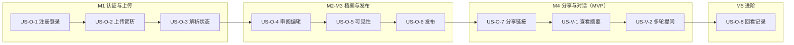

# 01 - 需求分析

> 本文档定义 AskMyResume 的产品需求：用户故事与验收标准、按模块的功能清单（含优先级）、非功能需求与明确不做的范围。所有决策以 [00-blueprint.md](00-blueprint.md) 为准；技术实现见 [03-architecture.md](03-architecture.md) 与 [05-rag-pipeline.md](05-rag-pipeline.md)，API 与数据模型分别见 [06-api-design.md](06-api-design.md)、[04-data-model.md](04-data-model.md)。

## 1. 产品背景与目标

**背景**：传统简历是一份静态文件，面试官初筛时只能线性阅读，想深入了解某段经历（"这个项目里你具体负责什么？"）只能等到面试。同时，作者本人希望系统性地学习 RAG 技术栈——一个"与候选人档案对话"的产品恰好覆盖 RAG 的完整闭环：解析 → 抽取 → chunking → embedding → 检索 → 生成 → 评估。

**目标**（按优先级排序）：

1. **学习 RAG（首要目标）**：亲手实现 RAG 管线的每个环节（不用 LangChain / LlamaIndex），并用 ragas + golden QA 集做量化评估。产品需求的取舍原则是"是否有利于把 RAG 学透"。
2. **可用的作品集项目（次要目标）**：最终产出一个能真实部署、可以放进自己简历里的完整全栈项目——本身也是求职的展示物。

**非目标**：商业化、多租户 SaaS、企业级高可用。见 §6。

**衡量成功的标准**：

- MVP（blueprint §11 的 M4）可完整走通六步业务流程：注册 → 上传 → 抽取 → 审阅发布 → 分享 → 面试官对话。
- 在 golden QA 集上，RAG 回答的 faithfulness 等指标可量化、可对比（详见 [10-testing-evaluation.md](10-testing-evaluation.md)）。
- 单人业余时间可维护：单机 Docker Compose 部署，月度 LLM 成本可控（见 §5.3）。

## 2. 用户角色

| 角色 | 认证方式 | 核心诉求 |
|---|---|---|
| 求职者（Owner） | 邮箱 + 密码，JWT | 低成本地把简历变成可对话的档案，并完全掌控哪些信息对外可见 |
| 面试官（Visitor） | 免登录，凭分享链接 token | 打开链接即用，快速、多轮地了解候选人，不注册不安装 |

角色与业务流程的对应关系见 blueprint §1-§2，此处不重复。

## 3. 用户故事与验收标准

编号规则：`US-O-*` 为求职者故事，`US-V-*` 为面试官故事。验收标准用 Given/When/Then 或清单式。

### 3.1 求职者（Owner）

**US-O-1 注册登录**：作为求职者，我想用邮箱和密码注册并登录，以便拥有自己的档案空间。

- Given 一个未注册的邮箱，When 我提交邮箱 + 密码注册，Then 注册成功并可直接登录进入 dashboard。
- Given 邮箱已被注册，When 我再次用它注册，Then 得到明确的"邮箱已存在"提示，而非模糊错误。
- Given 我已登录，When JWT 过期（24h），Then 后续请求被拒绝并引导重新登录。
- 密码错误时提示不泄露"邮箱是否存在"之外的信息。

**US-O-2 上传简历**：作为求职者，我想上传简历文件，让系统读出其中的文本。

- Given 一个 PDF / DOCX / Markdown / TXT 文件（≤10MB），When 我上传，Then 系统接收并开始解析，页面显示该简历条目。
- Given 一个超限或类型不在白名单的文件（如图片、扫描件），When 我上传，Then 被拒绝并提示原因（类型/大小）。
- 我可以查看自己上传过的简历列表，并删除不需要的简历。

**US-O-3 查看解析状态**：作为求职者，我想看到简历解析进行到哪一步，失败时知道原因。

- 简历列表/详情中可见解析状态：`pending / parsing / succeeded / failed`（枚举与 blueprint §6 一致）。
- Given 解析失败（如加密 PDF、扫描件无文本层），Then 我能看到人类可读的失败原因，并可删除后重新上传。
- 解析与 LLM 抽取是异步的：上传后我不必停在页面等待，稍后回来刷新即可看到结果（分钟级，见 §5.1）。

**US-O-4 审阅与编辑档案**：作为求职者，我想按维度审阅 LLM 抽取出的档案草稿，修正错漏、补充内容。

- Given 抽取完成，When 我打开档案页，Then 能看到按 blueprint §5 的 section_type 维度（basic_info、contact、summary、education、work_experience、projects、skills、certificates、hobbies、custom）组织的草稿。
- 我可以编辑任一维度的内容、增删条目（如某段工作经历）、调整维度排序，并新增 `custom` 自定义维度。
- 编辑保存的是草稿，不影响已发布的版本（见 US-O-6）。
- Given 我重复上传/抽取，Then 系统提示我确认覆盖或合并，不会静默覆盖我手工修改过的内容（blueprint §12：不做自动合并策略）。

**US-O-5 维度可见性设置**：作为求职者，我要控制每个维度对面试官是否可见。

- 每个维度可单独设为 `public` / `hidden`；默认 `contact` 为 `hidden`，其余为 `public`。
- Given 某维度为 `hidden`，Then 它不进入向量索引、不出现在公开摘要中，面试官提问也不会得到其中的信息（发布后生效）。
- 可见性修改属于草稿编辑，需再次发布才影响对外内容。

**US-O-6 发布档案**：作为求职者，我想把审阅好的草稿发布为对外版本。

- When 我点击发布，Then 系统生成一个不可变的版本快照并完成索引构建；发布完成后面试官侧看到的即是该版本。
- 发布后我继续编辑草稿不影响线上版本，直到下次发布。
- 我可以查看历史版本列表（版本号、发布时间）。
- Given 索引构建失败，Then 我能看到失败提示，线上仍保持上一个可用版本。

**US-O-7 管理分享链接（生成/命名/过期/撤销）**：作为求职者，我想为不同投递对象生成独立的分享链接，并随时收回。

- Given 档案已发布，When 我创建分享链接，Then 得到一个不可枚举的 URL，可复制发给面试官。
- 创建时可设置：label（如"投递 A 公司"）、过期时间（可不设 = 永久）、每日提问上限（默认 30）。
- 我能看到所有链接的列表及其状态（有效 / 已过期 / 已撤销）。
- When 我撤销某个链接，Then 该链接立即失效，面试官再访问时看到"链接已失效"页面；其余链接不受影响。
- Given 档案尚未发布，Then 无法创建分享链接（有明确提示）。

**US-O-8 回看对话记录**：作为求职者，我想看到面试官通过各链接问了什么、系统答了什么。

- 我能按分享链接查看会话列表（来源链接 label、开始时间）。
- 打开某个会话可看到完整的多轮问答内容。
- 我看不到面试官的真实身份（系统本来也不采集），只有匿名的会话维度信息。
- （P1）会话展示 token 用量与检索命中，便于我调优档案内容（依赖 blueprint §6 messages 表已保留的字段）。

### 3.2 面试官（Visitor）

**US-V-1 打开链接查看摘要**：作为面试官，我想点开链接立刻看到候选人概况，不注册、不登录。

- Given 一个有效的分享链接，When 我在浏览器打开，Then 直接看到候选人昵称与各可见维度的概览，无任何登录墙。
- Given 链接已过期或已撤销，Then 看到友好的失效提示页，不泄露候选人任何信息。
- `hidden` 维度（默认含联系方式）在页面上完全不出现。

**US-V-2 多轮对话提问**：作为面试官，我想围绕候选人的经历连续追问。

- When 我发送问题，Then 回答以打字机效果流式出现，首个字符在 3 秒内到达（见 §5.1）。
- （P1，M5 查询改写上线后）支持多轮指代："他在 X 公司做了什么？" → "那个项目用了什么技术栈？"能被正确理解；MVP 阶段多轮对话可用，但指代消解质量不作承诺。
- 回答只依据候选人档案：档案中没有的信息，回答明确说"档案中没有提到"，不编造；与候选人无关的问题被礼貌拒绝。
- 单条问题上限 500 字符；触发链接每日提问上限（默认 30）后得到明确提示而非静默失败。
- 刷新页面后开启新会话（MVP 不做会话恢复，见 [07-frontend.md](07-frontend.md)）。

### 3.3 用户故事与里程碑的对应

## 4. 功能需求清单

优先级定义：**P0** = MVP（M0-M4）必须；**P1** = 进阶（M5-M6）；**P2** = 可选，有余力再做。

### 4.1 认证

| 功能点 | 优先级 | 说明 |
|---|---|---|
| 邮箱 + 密码注册、登录、获取当前用户信息 | P0 | JWT，24h 有效期 |
| 密码强度基本校验（最短长度） | P0 | 学习项目不做复杂策略 |
| 修改昵称 | P1 | 昵称用于面试官侧展示 |

### 4.2 简历管理

| 功能点 | 优先级 | 说明 |
|---|---|---|
| 上传 PDF / DOCX / MD / TXT，类型白名单 + 10MB 上限 | P0 | |
| 异步解析出纯文本，状态可查（pending/parsing/succeeded/failed） | P0 | 失败含可读原因 |
| 简历列表、详情、删除 | P0 | |
| 触发 LLM 结构化抽取，生成档案草稿 | P0 | 模型 `claude-opus-5`，见 blueprint §4 |
| 重复抽取时的覆盖/合并人工确认 | P0 | 不做自动合并（blueprint §12） |

### 4.3 档案管理

| 功能点 | 优先级 | 说明 |
|---|---|---|
| 按 section_type 维度展示与编辑草稿（含条目增删、排序） | P0 | 枚举见 blueprint §5 |
| 新增 `custom` 自定义维度 | P0 | 标题 + 自由文本 |
| 每维度 `public` / `hidden` 可见性设置 | P0 | 默认 `contact` hidden |
| 草稿与已发布版本隔离 | P0 | |

### 4.4 发布与索引

| 功能点 | 优先级 | 说明 |
|---|---|---|
| 发布：生成不可变版本快照 + 按维度条目切 chunk + bge-m3 embedding + 写入向量索引 | P0 | 管线细节见 [05-rag-pipeline.md](05-rag-pipeline.md) |
| 历史版本列表 | P0 | 只读，不做版本回滚 |
| 索引构建失败提示，线上保持旧版本 | P0 | |

### 4.5 分享

| 功能点 | 优先级 | 说明 |
|---|---|---|
| 创建分享链接（不可枚举 token）、列表、撤销 | P0 | |
| 链接命名（label）、过期时间、每日提问上限（默认 30） | P0 | 上限配置在创建时给默认值即可 |
| 失效链接的友好提示页 | P0 | 不泄露候选人信息 |

### 4.6 公开对话（面试官侧）

| 功能点 | 优先级 | 说明 |
|---|---|---|
| 免登录打开链接查看公开摘要 | P0 | |
| 创建会话 + 提问，SSE 流式回答 | P0 | 基础 RAG：向量检索 top-k + 受约束生成 |
| 查询改写解决多轮指代（`claude-haiku-4-5`） | P1 | M5（blueprint §11）；MVP 用原始问题直接检索 |
| grounding：只依据档案回答、不编造、拒答无关问题 | P0 | |
| 混合检索（关键词 + 向量）与 bge-reranker 重排 | P1 | M5，用于对比检索质量 |
| 会话标题自动生成 | P2 | `claude-haiku-4-5` 轻任务 |
| 面试官侧回答附引用来源（命中的维度） | P2 | 有利于观察检索效果 |

### 4.7 对话记录（Owner 侧）

| 功能点 | 优先级 | 说明 |
|---|---|---|
| 按分享链接查看会话列表与完整消息 | P1 | M5 |
| 消息级 token 用量、检索命中展示 | P1 | 服务于 RAG 调优学习 |
| 对话记录导出 | P2 | |

**横切（不属于单一模块）**：限流分两步落地——链接级每日提问上限 + 提问长度上限为 P0（M4，成本兜底先行）；IP 级 slowapi 限流与链接级每日会话数上限为 P1（M6 安全加固）。ragas 评估与 golden QA 集为 P1（M5），详见 [10-testing-evaluation.md](10-testing-evaluation.md)。

## 5. 非功能需求

### 5.1 性能

- **对话首 token 延迟 < 3s**（面试官发出问题到流式回答首 token）：这是唯一体感关键的延迟。预算拆分与优化手段（查询改写用 `claude-haiku-4-5`、pgvector HNSW、prompt caching、`output_config={"effort": "low"}`）见 [05-rag-pipeline.md](05-rag-pipeline.md)。
- **解析/抽取允许异步分钟级**：上传解析与 LLM 抽取在后台执行（FastAPI `BackgroundTasks`），1-3 分钟内完成即可，界面靠状态轮询呈现进度，不阻塞用户。发布时的索引构建为同步秒级操作（见 [03-architecture.md](03-architecture.md) / [06-api-design.md](06-api-design.md)）。
- 并发预期极低（单用户 + 少数面试官同时在线），不设吞吐目标，不做压测承诺。

### 5.2 安全

安全需求以 blueprint §9 为基线，完整设计见 [08-security-privacy.md](08-security-privacy.md)。需求层面的要点：

- 隐私默认安全：`contact` 默认 hidden；`hidden` 维度在索引、摘要、回答中彻底不可见。
- 分享链接不可枚举、可过期、可撤销，撤销立即生效。
- 公开对话端点必须限流（IP 级 + 链接级每日上限），防止他人烧掉 Owner 的 LLM 预算。
- Prompt injection 防护：检索片段与面试官输入永远作为资料/user 消息，不作为指令。
- 公开端点不泄露 user_id、email 等内部标识。

### 5.3 成本意识

原则：**LLM 调用是本项目唯一的边际成本**（embedding 用本地 bge-m3，免费；服务器为已有单机）。要求月成本控制在个位数美元，估算思路如下（单价见 blueprint §4：`claude-opus-5` 输入 $5 / 输出 $25 每百万 token；`claude-haiku-4-5` $1/$5）：

| 用量项 | 粗略假设 | 月成本量级 |
|---|---|---|
| 简历抽取（opus-5） | 10 次/月 × (约 6K 输入 + 4K 输出) | ≈ $1.3 |
| 对话回答（opus-5） | 300 问/月 × (约 2K 输入 + 0.5K 输出) | ≈ $6.8 |
| 查询改写等轻任务（haiku-4-5） | 300 次/月 × 约 0.5K token | < $0.5 |

即正常学习/演示强度下约 **$5-10/月**。控制手段（作为需求约束）：

- 每链接每日提问上限（默认 30）是成本的硬闸门；限流是安全需求也是成本需求。
- 模型 ID 走配置不硬编码，预算紧张时整体切换 `claude-sonnet-5`（blueprint §4）。
- system prompt 稳定部分用 prompt caching 降低多轮对话的输入成本。
- 记录每条消息的 input/output token 用量，让实际成本可观测、可回溯。

### 5.4 可用性与运维

- **单机即可**：一台机器上 Docker Compose 跑 postgres / backend / frontend 三个服务（见 [11-deployment.md](11-deployment.md)）。不要求高可用，重启造成的短暂不可用可接受。
- 数据不可丢：PostgreSQL 数据卷持久化 + 简单的定期备份即可满足。
- 出错可诊断：解析/抽取/索引失败都要落下可读的错误信息（面向用户）与日志（面向开发者），因为"看清管线每一步"本身是学习目标。

## 6. 明确不做（Out of Scope）

以 blueprint §12 为准，逐条展开理由：

| 不做 | 理由 |
|---|---|
| 多档案 / 多简历自动合并策略 | 每用户一份档案已覆盖全部 RAG 学习点；合并策略是纯产品复杂度，学不到新东西。重复抽取时人工确认覆盖或合并即可 |
| 扫描件 OCR、图片简历 | OCR 是独立技术域，偏离 RAG 主线；遇到无文本层的文件明确报错提示即可 |
| 第三方登录（OAuth）、邮箱验证、找回密码 | 自实现 JWT + argon2 已满足学习与自用；这些是成熟工程套路，投入产出比低。密码忘了可由 Owner 直接操作数据库重置 |
| 多语言界面 | 界面中文即可；档案内容中英文皆可（bge-m3 双语支持），不影响 RAG 学习 |
| 高可用 / 分布式 / 消息队列 / K8s | 单用户级负载，`BackgroundTasks` 足够；引入队列与集群只会稀释学习焦点 |

此外，需求层面补充两条同样不做的：**面试官身份识别/统计分析**（只保留匿名会话记录，避免隐私复杂度）；**档案版本回滚**（版本快照仅用于对外一致性与追溯，回滚可通过再次编辑发布实现）。
