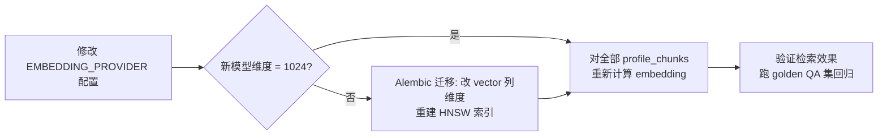

# 02 - 技术选型

> 本文档说明 [00-blueprint.md](00-blueprint.md) §3/§4 中各项技术决策的**理由、备选方案对比、以及什么情况下应该换**。选型结论以蓝图为准，本文不重复展开决策本身；架构与模块划分见 [03-architecture.md](03-architecture.md)，表结构与索引见 [04-data-model.md](04-data-model.md)。

## 0. 选型原则

这是单人业余学习项目，所有取舍都围绕三条原则：

1. **学习价值优先**：核心环节（RAG 管线）亲手写，周边环节（Web 框架、ORM）用最省心的成熟方案。
2. **运维面最小**：能一个进程/一个数据库解决的，不引入第二个组件。
3. **可替换**：凡是将来可能换的（embedding、LLM、存储），用接口抽象 + 配置隔离，但不为"可能"提前多写代码。

## 1. 向量存储：pgvector

**选了什么**：PostgreSQL 16 + pgvector 扩展，向量与关系数据同库（`profile_chunks.embedding vector(1024)`，HNSW + cosine）。

**为什么**：本项目的向量规模极小——一份档案切出的 chunk 通常只有 10~40 条，即使上百个用户也不过几千行向量。任何专用向量库在这个量级上都毫无性能优势，而 pgvector 让我们：

- **一库搞定**：users/profiles/chunks 全在一个 PostgreSQL 里，Docker Compose 少一个服务，备份/迁移/事务一套逻辑。发布档案时"写快照 + 写 chunk + 写向量"可以放在同一个数据库事务里，专用向量库做不到。
- **检索时天然带关系过滤**：`WHERE profile_version_id = ?` 与向量排序在一条 SQL 里完成，不需要在应用层做两套存储的数据同步。
- **学习价值不打折**：HNSW 参数、cosine 距离、召回调优这些知识点 pgvector 全都能练到。

**备选方案对比**：

| 方案 | 优势 | 对本项目的劣势 |
|---|---|---|
| **pgvector**（选定） | 与关系数据同库、同事务；运维为零增量 | 亿级向量规模下性能不如专用库（与本项目无关） |
| **Qdrant** | 独立向量库中工程完成度高，过滤/payload 功能强 | 多一个服务要部署、备份；数据要与 PostgreSQL 手工保持一致 |
| **Chroma** | 内嵌模式起步最快，教程常用 | 定位偏原型/实验；持久化与并发能力弱，等于"玩具 + 还是要另管数据" |
| **Milvus** | 面向十亿级向量的分布式架构 | 组件多（etcd、MinIO...），是本项目运维负担的反面典型 |

**什么情况下该换**：单表向量到达百万级、或需要跨库共享向量服务时，再评估 Qdrant。届时因为检索逻辑集中在 `rag/retriever.py`，替换成本可控。学习期不换。

## 2. RAG 框架：手写管线，不用 LangChain / LlamaIndex

**选了什么**：不引入任何 RAG 框架，在 `backend/app/rag/` 下手写 parser → extractor → chunker → embedder → retriever → generator 六个模块（见 [05-rag-pipeline.md](05-rag-pipeline.md)）。

**为什么**：项目的首要目标是**学会 RAG 的每个环节**。框架把 chunking 策略、prompt 拼装、检索编排都封装成一行 `chain.invoke()`，学习者得到的是"会调框架"而不是"懂 RAG"。手写的代价其实很低——本项目的管线是固定的单一场景（简历档案问答），没有框架擅长的"多数据源、多策略动态编排"需求，六个模块加起来预计不到千行代码。

**框架到底解决什么问题**（学完后判断何时值得用）：

| 框架 | 核心价值 | 何时值得用 |
|---|---|---|
| **LangChain** | 大量第三方集成（Loader/VectorStore/LLM 适配器）、链式编排、agent 工具调用 | 需要快速接入很多异构数据源和模型供应商、或做多步 agent 工作流时 |
| **LlamaIndex** | 以"索引/查询"为中心的抽象，内置多种高级索引结构（树状、关键词表、知识图谱）与查询变换 | 检索策略本身是产品重点、需要频繁实验不同索引结构时 |

**手写的代价与对策**：要自己处理重试、并发 embedding、prompt 版本管理——这些恰好也是学习目标。文档中（尤其 05）会对照框架的做法写"LangChain 中等价于 XXX"，保证学完后能无障碍读懂框架代码。

**什么情况下该换**：如果未来把项目扩展成"接入任意文档类型的通用问答"，异构 Loader 的适配工作量会超过手写的学习收益，那时引入 LlamaIndex 的 Reader/Index 层是合理的。当前范围（M0-M6）不换。

## 3. Embedding：本地 bge-m3，抽象 EmbeddingProvider 接口

**选了什么**：默认 BAAI/bge-m3（`sentence-transformers` 本地推理，1024 维），通过 `EmbeddingProvider` 接口抽象，配置项 `EMBEDDING_PROVIDER` 可切换到 Voyage AI 等 API 方案。

**为什么**：简历档案是典型的中英混排文本（中文描述 + 英文技术名词），bge-m3 的中英双语检索效果在开源模型中属第一梯队，而且**免费、离线、无限调用**——学习期会反复重建索引做实验，API 计费方案会让人心疼到不敢实验。

**备选方案对比**：

| 方案 | 维度 | 成本 | 中文效果 | 备注 |
|---|---|---|---|---|
| **bge-m3**（选定） | 1024 | 免费（本地推理） | 优秀，专为多语言优化 | 模型约 2GB；CPU 可跑（单条几十 ms 级），无 GPU 也够用 |
| **Voyage AI voyage-3** | 1024 | 按量计费（约 $0.06/M tokens） | 优秀，多语言榜单靠前 | 维度与 bge-m3 相同，切换**不需要改表结构** |
| **OpenAI text-embedding-3-small** | 1536（可降维） | 约 $0.02/M tokens | 一般，中文明显弱于前两者 | 便宜但不适合中文为主的场景 |
| **OpenAI text-embedding-3-large** | 3072（可降维） | 约 $0.13/M tokens | 中等 | 维度大，存储与检索开销都翻倍 |

**切换成本——最重要的一条**：不同模型的向量空间互不兼容，**换 embedding 模型必须重建全部向量**（重新计算所有已发布版本的 `profile_chunks.embedding`）；若新模型维度 ≠ 1024，还要先做 Alembic 迁移改列定义并重建 HNSW 索引。这就是为什么维度同为 1024 的 voyage-3 被选为第一备选。



**什么情况下该换**：部署到无力跑本地模型的低配服务器（内存 < 2GB）、或本地推理延迟影响发布体验时，切到 voyage-3。切换动作只是改环境变量 + 触发重建，代码不动。

## 4. LLM：Claude 模型分工

**选了什么**：Anthropic Claude，官方 `anthropic` Python SDK。模型 ID 全部走配置（环境变量），代码不硬编码：

| 任务 | 默认模型 | 为什么 |
|---|---|---|
| 简历结构化抽取 | `claude-opus-5` | 抽取质量直接决定 chunk 质量、进而决定整个 RAG 上限，值得用最强模型；`client.messages.parse` + Pydantic schema 保证输出合法 JSON |
| 对话回答生成 | `claude-opus-5` | 面试官对话是产品门面，grounding 约束（"档案中没有就说没有"）对模型能力敏感；`client.messages.stream` 流式，`output_config={"effort": "low"}` 压低延迟 |
| 查询改写、会话标题等轻任务 | `claude-haiku-4-5` | 任务简单、调用频繁（每轮对话都要改写一次），用便宜快速的模型 |

**成本表**（每百万 token，输入/输出）：

| 模型 | 输入 | 输出 | 定位 |
|---|---|---|---|
| `claude-opus-5` | $5 | $25 | 抽取 + 对话（默认） |
| `claude-sonnet-5` | $3 / 优惠期 $2（2026-08-31 前） | $15 / 优惠期 $10 | 预算敏感时的降级选项 |
| `claude-haiku-4-5` | $1 | $5 | 查询改写等轻任务 |

**粗略成本估算**（按典型 token 量，数量级参考）：

| 场景 | 输入 tokens | 输出 tokens | Opus 5 成本 | Sonnet 5（优惠价）成本 |
|---|---|---|---|---|
| 单次对话（system 提示 ~400 + 6 个检索片段 ~2100 + 历史与问题 ~1000；回答 ~500） | ~3,500 | ~500 | ≈ $0.030 | ≈ $0.012 |
| 查询改写（Haiku，每轮对话附带一次） | ~800 | ~60 | ≈ $0.001 | — |
| 单次简历抽取（简历全文 + 指令 ~5,000；结构化 JSON ~3,000） | ~5,000 | ~3,000 | ≈ $0.10 | ≈ $0.04 |

即：Opus 5 下一次抽取约一毛钱美元、聊 30 轮约 $1。个人学习项目每月 API 花费预计在 $5~$10 之间，可控。system prompt 的稳定部分加 `cache_control: {"type": "ephemeral"}` 走 prompt caching（缓存读取约为原价 1/10），多轮对话下实际成本还会低于上表。

**预算敏感时的配置化降级**：把抽取/对话模型换成 `claude-sonnet-5` 只需改环境变量，不改代码：

```python
# backend/app/core/config.py（节选）
class Settings(BaseSettings):
    extract_model: str = "claude-opus-5"
    chat_model: str = "claude-opus-5"
    light_model: str = "claude-haiku-4-5"
```

```bash
# .env —— 预算敏感配置
EXTRACT_MODEL=claude-sonnet-5
CHAT_MODEL=claude-sonnet-5
```

**SDK 用法注意**（蓝图 §4 已列，写代码时逐条遵守）：`anthropic.AsyncAnthropic()` 零参构造（统一异步客户端）、从 `ANTHROPIC_API_KEY` 读密钥；`claude-opus-5` 默认开启 adaptive thinking，**不要传** `temperature`/`top_p`/`top_k`/`budget_tokens`（会 400）；读响应前先查 `stop_reason`（可能为 `"refusal"`）；长输出一律 `client.messages.stream`。

**为什么不选 OpenAI / 本地 LLM**：本项目抽取环节重度依赖结构化输出的可靠性与长文档理解，对话环节依赖抗 prompt injection 的指令遵循，Claude 在这两点上表现稳定，且官方 SDK 的 `messages.parse` + Pydantic 工作流与我们的 `ProfileExtraction` schema 抽取设计（见 [05-rag-pipeline.md](05-rag-pipeline.md)）严丝合缝。本地开源 LLM（Qwen 等）免费但抽取质量波动大，会把调试时间耗在模型能力而非 RAG 本身上，与学习目标冲突。

**什么情况下该换**：所有模型 ID 都在配置层，换模型（含未来新版本 Claude）零代码改动；换供应商则需要重写 `rag/extractor.py`/`rag/generator.py` 中的 SDK 调用，工作量一两天。

## 5. 后端：Python 3.12 + FastAPI

**选了什么**：FastAPI，依赖用 `uv` 管理。

**为什么**：RAG 生态几乎全在 Python（sentence-transformers、ragas、PyMuPDF），后端语言没有第二个候选。框架层面：

| 框架 | 对本项目的评价 |
|---|---|
| **FastAPI**（选定） | 原生 async（LLM/embedding 调用都是 IO 密集）；Pydantic 请求/响应模型与抽取 schema 复用同一套类型体系；自动生成 OpenAPI 文档，前后端联调省事；`BackgroundTasks` 够跑异步抽取，不用上消息队列；SSE 流式支持直接 |
| **Flask** | 同步模型，SSE 长连接 + 并发 LLM 调用要靠额外方案（gevent 等）；无内置校验，Pydantic 要自己接 |
| **Django** | 全家桶（admin、ORM、模板）大量用不上；async 支持仍是补丁式的；学习成本花在框架而非 RAG 上 |

**uv 而非 pip/poetry**：单二进制、解析与安装速度快一个数量级、`pyproject.toml` + lockfile 一条龙（`uv sync` 即可复现环境），对单人项目就是"少操心"。

**什么情况下该换**：不换。FastAPI 是当前 Python API 服务的默认答案。

## 6. ORM：SQLAlchemy 2.0（async）+ Alembic

**选了什么**：SQLAlchemy 2.0 异步模式（asyncpg 驱动）+ Alembic 迁移。

**为什么**：与 FastAPI 的 async 端点保持同一并发模型，请求处理链路里没有阻塞的数据库调用；2.0 风格的 `select()` API 类型友好；pgvector 有官方 SQLAlchemy 集成（`pgvector.sqlalchemy.Vector`），向量列和 HNSW 查询都能在 ORM 层表达。Alembic 管 schema 演进——本项目表结构会随里程碑推进多次变更（M3 加向量表、M5 可能加全文索引），手写 SQL 迁移不可持续。

**备选**：Django ORM（绑定 Django，不适用）；SQLModel（FastAPI 作者作品，本质是 SQLAlchemy 薄封装，但生态文档少，遇到复杂查询还是要回到 SQLAlchemy 概念，不如直接学正主）；裸 asyncpg（省一层抽象但要手写全部 SQL 与对象映射，学习收益低）。

**什么情况下该换**：不换。

## 7. 前端：Next.js 15（App Router）+ TypeScript + Tailwind CSS + shadcn/ui

**选了什么**：Next.js 15 App Router，TypeScript，Tailwind CSS，shadcn/ui 组件库。

**为什么**：

- 面试官侧的分享页（`chat/[token]`）是**对外公开页面**，SSR 带来首屏速度与链接预览（分享到微信/邮件时的 meta 信息）优势，纯 SPA 做不到。
- shadcn/ui 提供可复制进项目的组件源码（非黑盒依赖），配合 Tailwind 能快速做出可看的界面——单人项目没有设计师，这很关键。
- TypeScript 与后端 Pydantic 模型两边强类型，API 约定（见 [06-api-design.md](06-api-design.md)）不容易在联调中悄悄漂移。

**备选：Vue 3 + Vite**：框架本身完全够用、上手更平缓；但纯 Vite SPA 缺 SSR（分享页首屏与 SEO 弱），上 Nuxt 又与 Next.js 复杂度相当。生态上 React + shadcn/ui + SSE 流式聊天的现成参考实现最多，抄作业成本最低。若开发者已有深厚 Vue 经验，换成 Nuxt 3 是完全合理的等价替换——本项目前端不是学习重点，选熟不选新。

**什么情况下该换**：前端只消费 REST/SSE API，与后端完全解耦，任何时候都可以整体重写而不影响后端。

## 8. Rerank（M5）：bge-reranker-v2-m3

**是什么**：reranker 是 **cross-encoder**——把"查询 + 候选 chunk"拼成一条输入送进模型，输出一个相关性分数。与 embedding 检索的 bi-encoder（查询和文档**各自独立**编码成向量再算 cosine）相比，cross-encoder 能看到两段文本的逐词交互，精度显著更高，但每对都要跑一次模型推理，只能用于对少量候选的精排。bge-reranker-v2-m3 与 bge-m3 同门，同样中英双语、本地免费。

**在管线中的位置**：向量检索（M5 起加混合检索）先召回 top-k=6，reranker 对这 6 条精排后取 top-3 进入生成——"粗召回 + 精排"两段式是工业界标准做法。

**为什么放到 M5 而不是一开始就上**：

1. 本项目单份档案只有几十个 chunk，基础向量检索的准确率可能已经够用——**没有评估基线之前加 rerank，无法知道它带来了多少提升**。
2. M5 同期建设 golden QA 集 + ragas 评估（见 [10-testing-evaluation.md](10-testing-evaluation.md)），先测出基线的 context_precision/recall，再加 rerank 做 A/B 对比，这才是"学会 RAG 调优"，而不是"堆上所有组件"。
3. 学习节奏上，M4 前的目标是跑通 MVP 闭环，rerank 属于锦上添花的调优手段。

**什么情况下该换/不加**：如果 M5 评估显示 rerank 对 golden QA 集指标无显著提升（小语料下完全可能），就保持关闭，把结论写进评估报告——负结果也是学习成果。

## 9. 其他选型速记

以下各项在蓝图 §3 已定，理由简述如下；不展开的项目在对应文档中细化。

| 项 | 选择 | 为什么 / 备选 | 何时换 |
|---|---|---|---|
| 文档解析 | PyMuPDF（PDF）、python-docx（DOCX）、直读（MD/TXT） | PyMuPDF 提取文本快且版面还原好；备选 pdfplumber（表格更强但慢）。不做 OCR，扫描件直接报错提示 | 用户反馈大量 PDF 解析乱序时试 pdfplumber |
| RAG 评估 | ragas + 人工 golden QA 集 | ragas 是 RAG 评估事实标准，faithfulness 等指标开箱即用；纯人工评审不可重复、纯自动指标会骗人，两者都要 | 不换 |
| 认证 | JWT（`pyjwt`）+ argon2（`argon2-cffi`） | 自实现最小可用认证本身是学习点；argon2 是当前密码哈希首选。备选 Auth0/Supabase Auth 属外部依赖，超出学习需要 | 若做成多人产品再上成熟 IdP |
| 限流 | slowapi | FastAPI 生态标配，装饰器即用；重点保护免登录的公开对话端点（见 [08-security-privacy.md](08-security-privacy.md)） | 不换 |
| 文件存储 | 本地磁盘 + `Storage` 接口抽象 | 单机部署本地盘最简；接口留好，换 MinIO/S3 只改实现类 | 需要多实例部署或备份上云时 |
| 流式输出 | SSE | 单向流式文本输出场景 SSE 比 WebSocket 简单（纯 HTTP、自动重连语义、无握手升级）；前端 `fetch` + ReadableStream 消费（见 [07-frontend.md](07-frontend.md)） | 需要双向通信（如协作编辑）才考虑 WebSocket |
| 部署 | Docker Compose（postgres/backend/frontend） | 单机三容器，`docker compose up` 一条命令复现全部环境；K8s 对本项目是纯负担（见 [11-deployment.md](11-deployment.md)） | 不换 |

## 10. 决策回顾时点

- **M4（MVP 完成）**：检查 Opus 5 的实际账单，决定是否切 `claude-sonnet-5`。
- **M5（评估就绪）**：用 golden QA 基线数据决定 rerank 与混合检索是否保留。
- **M6（部署）**：根据目标服务器配置决定 embedding 是否切 voyage-3 API。
