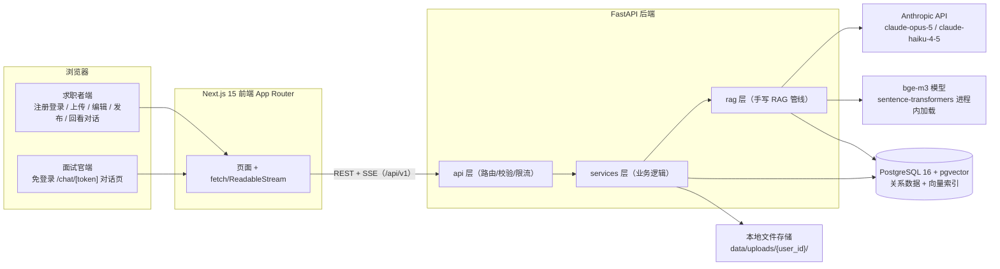
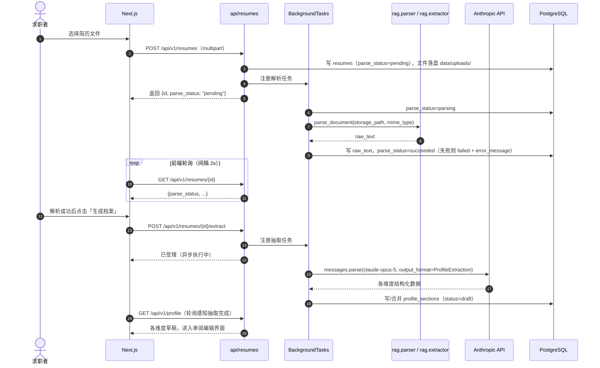
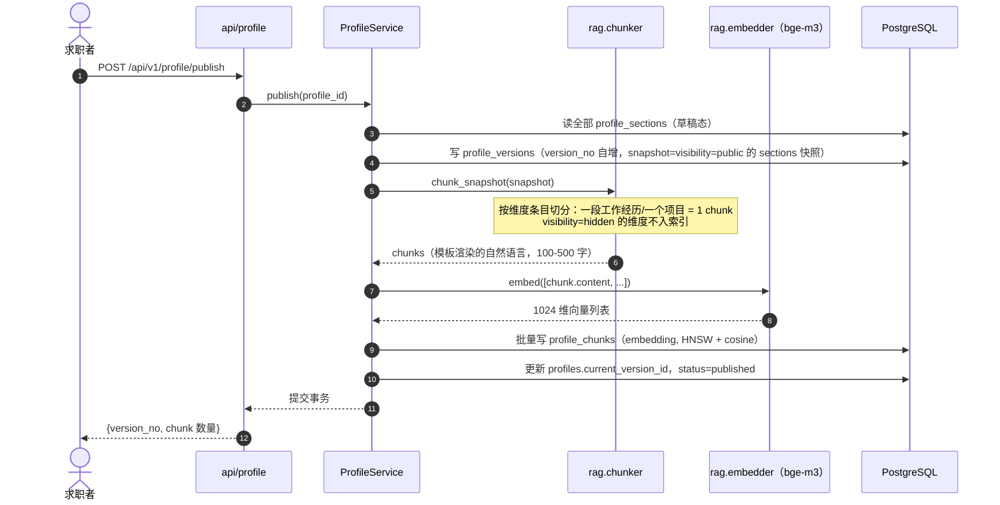
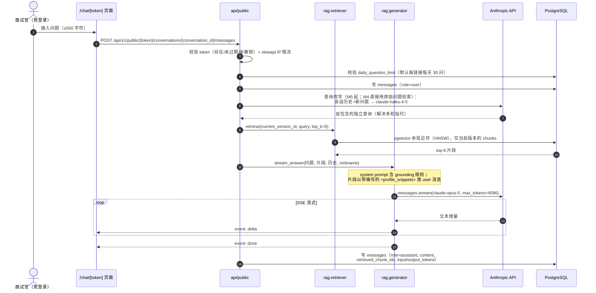

# 03 - 系统架构

> 本文档描述 AskMyResume 的总体架构、后端分层职责、三个核心流程的时序，以及关键设计决策与配置管理。所有决策以 [00-blueprint.md](00-blueprint.md) 为准；字段级表结构见 [04-data-model.md](04-data-model.md)，RAG 各环节细节见 [05-rag-pipeline.md](05-rag-pipeline.md)，逐端点定义见 [06-api-design.md](06-api-design.md)。

## 1. 总体架构

单机部署、前后端分离的三层结构：Next.js 前端负责页面与 SSE 消费，FastAPI 后端承载全部业务与 RAG 管线，PostgreSQL 16 + pgvector 同时充当关系库和向量库（一库搞定，无独立向量数据库）。



要点：

- 前端不直连数据库或 Anthropic API，一切经由 `/api/v1`（认证端点用 Bearer JWT，公开端点凭分享链接 token）。
- bge-m3 不是独立服务，而是 FastAPI 进程内加载的模型（见 §4.3）；Anthropic API 是唯一的外部依赖。
- 部署形态为 Docker Compose 三个服务（postgres、backend、frontend），见 [11-deployment.md](11-deployment.md)。

## 2. 后端分层职责

目录结构与 [00-blueprint.md](00-blueprint.md) §10 一致，依赖方向单向：`api → services → rag / models`，rag 层不 import services，core 被所有层引用。

| 模块 | 职责（一句话） |
|---|---|
| `api/` | HTTP 路由、请求参数校验（Pydantic schema）、认证依赖注入、限流声明；不写业务逻辑 |
| `services/` | 业务用例编排与事务边界：上传、抽取触发、发布、分享链接、会话管理 |
| `rag/` | 手写 RAG 管线的全部环节，纯技术模块，不感知 HTTP |
| `models/` | SQLAlchemy 2.0（async）ORM 模型，与 §6 数据模型一一对应 |
| `schemas/` | Pydantic 请求/响应模型 + LLM 抽取用的 `ProfileExtraction` schema |
| `core/` | `config.py`（pydantic-settings）、`security.py`（argon2 + JWT）、`deps.py`（依赖注入：当前用户、DB session 等） |

### rag 层各模块与关键接口示意

| 模块 | 职责 |
|---|---|
| `parser.py` | 文件 → 纯文本（PyMuPDF / python-docx / 直读） |
| `extractor.py` | 简历文本 → `ProfileExtraction` 结构化数据（claude-opus-5 structured outputs） |
| `chunker.py` | 版本快照 → 按维度条目切分并模板渲染为自然语言 chunk |
| `embedder.py` | 文本列表 → 1024 维向量；抽象 `EmbeddingProvider` 接口，默认本地 bge-m3 |
| `retriever.py` | 查询 → pgvector 余弦近邻 top-k chunk |
| `generator.py` | 问题 + 检索片段 + 历史 → claude-opus-5 流式生成回答 |
| `prompts.py` | 集中管理抽取、查询改写、回答生成的 prompt 模板 |

接口示意（签名说明设计，非完整实现）：

```python
# rag/parser.py
def parse_document(path: Path, mime_type: str) -> str: ...

# rag/extractor.py —— messages.parse + Pydantic，保证输出合法 JSON
async def extract_profile(raw_text: str) -> ProfileExtraction:
    response = client.messages.parse(
        model=settings.extract_model,      # claude-opus-5，不硬编码
        max_tokens=16000,
        messages=[...],
        output_format=ProfileExtraction,   # schemas 中定义的 Pydantic 模型
    )
    # 先检查 stop_reason（可能为 "refusal"），再读 parsed_output
    ...

# rag/chunker.py —— Chunk 是轻量 dataclass，字段与 profile_chunks 表对应
def chunk_snapshot(snapshot: dict) -> list[Chunk]: ...

# rag/embedder.py —— 可切换 Voyage AI 等 API 方案
class EmbeddingProvider(Protocol):
    def embed(self, texts: list[str]) -> list[list[float]]: ...

# rag/retriever.py
async def retrieve(db, profile_version_id: UUID,
                   query: str, top_k: int = 6) -> list[RetrievedChunk]: ...

# rag/generator.py —— messages.stream 流式，逐段 yield 给 SSE
async def stream_answer(question: str, snippets: list[RetrievedChunk],
                        history: list[Message], nickname: str) -> AsyncIterator[str]: ...
```

services 层的典型编排（举一例）：`ProfileService.publish()` 依次调用「读草稿 → 写快照 → chunker → embedder → 写 profile_chunks」，整个过程在一个数据库事务里，rag 层各模块彼此不直接调用，由 service 串起来——这样每个环节都可以单测（见 [10-testing-evaluation.md](10-testing-evaluation.md)）。

## 3. 核心流程时序

### 3.1 上传 → 解析 → LLM 抽取 → 档案草稿

文件解析和 LLM 抽取都是秒级到几十秒的慢操作，不能阻塞 HTTP 请求，用 FastAPI `BackgroundTasks` 异步执行，前端轮询 `parse_status`（`pending/parsing/succeeded/failed`）感知进度。



抽取完成状态的具体字段约定见 [06-api-design.md](06-api-design.md)；已有档案时的覆盖/合并确认交互见 [07-frontend.md](07-frontend.md)。

### 3.2 发布 → 版本快照 → chunk → embedding → 写入索引

发布是**同步**完成的：一份档案通常只切出几十个 chunk，本地 bge-m3 批量编码是秒级操作，同步执行可以让整个过程共享一个事务——失败即回滚，不会留下「有快照没索引」的半成品。



切分策略与模板渲染的细节见 [05-rag-pipeline.md](05-rag-pipeline.md)；HNSW 索引参数见 [04-data-model.md](04-data-model.md)。

### 3.3 面试官提问 → 检索 → 受约束生成 → SSE 流式返回



SSE 事件格式约定见 [06-api-design.md](06-api-design.md)；grounding 规则与 prompt injection 防护见 [05-rag-pipeline.md](05-rag-pipeline.md) 与 [08-security-privacy.md](08-security-privacy.md)。

## 4. 关键设计决策

### 4.1 发布用不可变版本快照，而不是直接索引草稿

发布时把全部 sections 冻结为 `profile_versions.snapshot`（JSONB），chunk 和 embedding 都挂在 `profile_version_id` 下，理由：

- **草稿可继续改，不影响线上**。求职者发布后随时编辑 `profile_sections`，面试官看到的始终是 `current_version_id` 指向的快照，直到下一次发布。没有「编辑到一半被人提问」的中间态问题。
- **回答可追溯**。`messages.retrieved_chunk_ids` 指向确定不变的 chunk 内容，回看对话记录时能精确还原「当时模型看到了什么」，这对 RAG 调试和 [10-testing-evaluation.md](10-testing-evaluation.md) 的评估至关重要。
- **实现最简**。重新发布 = 新建一个版本 + 全量重建该版本的 chunks，不需要做增量索引更新、脏标记这类复杂机制——学习项目里全量重建（几十个 chunk）完全够快。

### 4.2 抽取用 FastAPI BackgroundTasks，而不是消息队列

Celery/Redis 这类消息队列在这里是过度设计：

- 单用户、单进程、低频任务（一个用户偶尔上传一次简历），BackgroundTasks 在同进程事件循环里跑完全够用，零额外组件、零运维。
- 失败模式可接受：进程重启会丢正在执行的任务，但 `parse_status` 会停在 `parsing`/`failed`，用户重新点一次上传或抽取即可恢复——没有必须精确执行一次的语义。
- 这是 [00-blueprint.md](00-blueprint.md) §12 明确的 out of scope（不做高可用/消息队列）。若将来真要换，只需把 service 里「注册后台任务」的一行换成投递队列，分层结构不变。

### 4.3 embedding 模型：进程内单例，启动时加载

bge-m3 通过 `sentence-transformers` 在 FastAPI 进程内加载，做成模块级单例，在 lifespan 启动钩子中初始化：

```python
# main.py（示意）
@asynccontextmanager
async def lifespan(app: FastAPI):
    app.state.embedder = get_embedding_provider(settings)  # 首次加载数十秒
    yield
```

- **为什么不按请求加载**：模型权重约 2GB，冷加载数十秒，必须常驻内存复用。
- **为什么不拆独立服务**：单体后端 + 进程内调用是最简单可跑的形态；`EmbeddingProvider` 接口已经抽象了这一层，将来切到 Voyage AI（`voyage-3`）等 API 方案时只是换实现，不动调用方。
- **代价**：backend 容器内存占用变大、启动变慢，这在单机学习项目里可接受；部署侧的内存预算见 [11-deployment.md](11-deployment.md)。

## 5. 配置管理

用 pydantic-settings 从 `.env` 读取配置，全部配置集中在 `core/config.py`，代码中不硬编码模型 ID：

```python
# core/config.py（关键片段）
from pydantic_settings import BaseSettings, SettingsConfigDict

class Settings(BaseSettings):
    model_config = SettingsConfigDict(env_file=".env")

    database_url: str                          # PostgreSQL 连接串
    jwt_secret: str                            # JWT 签名密钥
    extract_model: str = "claude-opus-5"       # 简历结构化抽取
    chat_model: str = "claude-opus-5"          # 对话回答生成
    light_model: str = "claude-haiku-4-5"      # 查询改写等轻任务
    embedding_provider: str = "local"          # local(bge-m3) | voyage
    embedding_model: str = "BAAI/bge-m3"       # provider=voyage 时改为 voyage-3
    upload_dir: str = "data/uploads"
    cors_origins: str = "http://localhost:3000"        # .env 逗号分隔，使用处 .split(",")
    frontend_base_url: str = "http://localhost:3000"   # 拼接分享链接完整 URL 的前端基址
    rate_limit_public_chat: str = "10/minute"  # 公开对话端点 IP 级限流（slowapi 语法）
    rate_limit_auth: str = "5/minute"          # 登录/注册端点限流，防爆破

settings = Settings()
```

两点约定：

- `ANTHROPIC_API_KEY` 不进 Settings 显式传递——后端统一使用 `anthropic.AsyncAnthropic`（异步客户端），零参构造时自动从环境变量读取（blueprint §4），`.env` 里配置即可；用异步客户端是为了避免在 async def 中调用同步 SDK 阻塞事件循环。
- 预算敏感时把 `extract_model`/`chat_model` 换成 `claude-sonnet-5` 只需改 `.env`，不改代码。

完整配置项清单（含 Docker Compose 环境变量、限流参数等）见 [11-deployment.md](11-deployment.md)。
