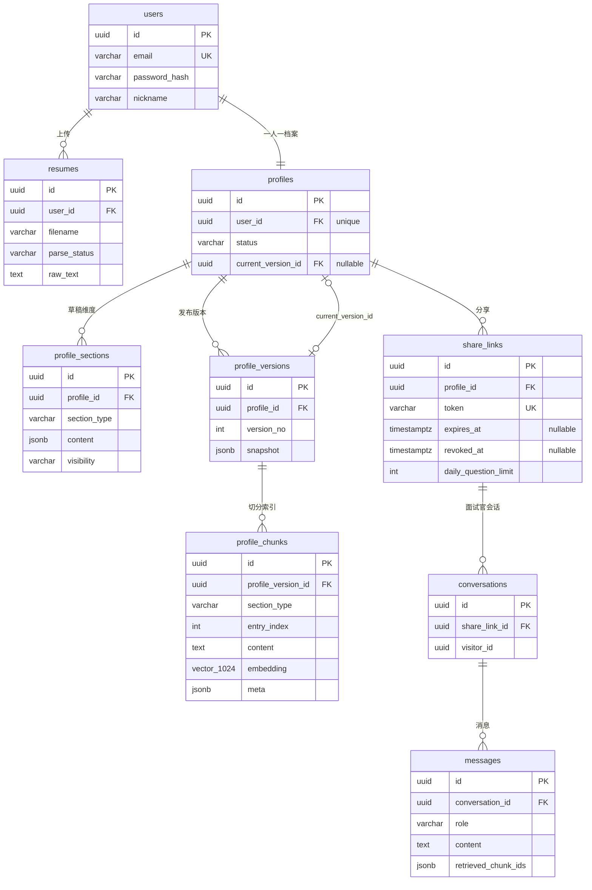

# 04 - 数据模型

> 本文档定义 AskMyResume 的全部数据库表结构、ER 关系、JSONB 内容格式与 pgvector 索引方案，是 [00-blueprint.md](00-blueprint.md) §5/§6 的展开。模块划分与数据流见 [03-architecture.md](03-architecture.md)，chunk 的生成逻辑见 [05-rag-pipeline.md](05-rag-pipeline.md)。

## 1. 总览与约定

- 数据库：PostgreSQL 16 + pgvector 扩展，一库承载关系数据与向量检索。
- ORM：SQLAlchemy 2.0（async），迁移用 Alembic。
- 主键统一 UUID（应用侧 `uuid4()` 生成，避免依赖数据库函数，便于测试）。
- 时间字段统一 `timestamptz`，写入 UTC；命名 `created_at` / `updated_at` / 语义化的 `published_at`、`started_at` 等。
- 枚举（`parse_status`、`status`、`section_type`、`visibility`、`role`）在数据库中用 `varchar` + 应用层校验（Pydantic / Python `StrEnum`），不用 PG 原生 enum——学习项目里改枚举值不想跑一次 `ALTER TYPE` 迁移。
- 半结构化内容（档案维度内容、版本快照、chunk 元数据）用 JSONB，结构由 Pydantic schema 约束，格式见 §4-§6。

## 2. ER 图（9 张表）



两条值得注意的关系：

- `profiles.current_version_id` 与 `profile_versions.profile_id` 互相引用。约定：`profile_versions.profile_id` 是普通 FK；`current_version_id` 是 nullable FK，发布成功后回填。Alembic 里先建 `profiles`（不带该 FK），建完 `profile_versions` 后再 `ADD CONSTRAINT`，避免循环依赖。
- `conversations` 只挂在 `share_links` 下，不直接关联 `users`——Owner 查自己的对话记录时经 `share_links.profile_id → profiles.user_id` 两跳，公开端点则完全接触不到 user 维度的标识（见 [08-security-privacy.md](08-security-privacy.md)）。

## 3. 逐表字段定义

### 3.1 users

| 字段 | 类型 | 约束 | 说明 |
|---|---|---|---|
| id | uuid | PK | |
| email | varchar(255) | unique, not null | 登录名；应用层小写归一后存储 |
| password_hash | varchar(255) | not null | argon2 哈希（`argon2-cffi`） |
| nickname | varchar(50) | not null | 展示名，进入公开摘要与 RAG system prompt |
| created_at | timestamptz | not null | |
| updated_at | timestamptz | not null | |

### 3.2 resumes

| 字段 | 类型 | 约束 | 说明 |
|---|---|---|---|
| id | uuid | PK | |
| user_id | uuid | FK → users.id, not null | ON DELETE CASCADE |
| filename | varchar(255) | not null | 原始文件名（仅展示用，不做路径） |
| storage_path | varchar(500) | not null | `data/uploads/{user_id}/{uuid}.pdf` 形式 |
| mime_type | varchar(100) | not null | 白名单：PDF / DOCX / MD / TXT |
| size_bytes | int | not null | 上限 10MB，应用层校验 |
| raw_text | text | nullable | 解析出的纯文本；解析前为 NULL |
| parse_status | varchar(20) | not null, default `pending` | `pending` / `parsing` / `succeeded` / `failed` |
| error_message | text | nullable | 解析失败原因（如"疑似扫描件，无文本层"） |
| created_at | timestamptz | not null | |

### 3.3 profiles

| 字段 | 类型 | 约束 | 说明 |
|---|---|---|---|
| id | uuid | PK | |
| user_id | uuid | FK → users.id, **unique**, not null | 每用户一份档案（blueprint §12） |
| status | varchar(20) | not null, default `draft` | `draft` / `published`（发布过即为 published，之后编辑草稿不回退） |
| current_version_id | uuid | FK → profile_versions.id, nullable | 当前生效版本；未发布过为 NULL |
| created_at | timestamptz | not null | |
| updated_at | timestamptz | not null | |

### 3.4 profile_sections（草稿态）

| 字段 | 类型 | 约束 | 说明 |
|---|---|---|---|
| id | uuid | PK | |
| profile_id | uuid | FK → profiles.id, not null | ON DELETE CASCADE |
| section_type | varchar(30) | not null | §5 的 10 个枚举值之一 |
| content | jsonb | not null | 结构随 section_type 而异，见 §4 |
| sort_order | int | not null, default 0 | 展示顺序，用户可拖动调整 |
| visibility | varchar(10) | not null | `public` / `hidden`；默认 `contact` 为 hidden，其余 public |
| updated_at | timestamptz | not null | |

约束：除 `custom` 外，每种 section_type 每档案最多一条，用部分唯一索引表达（见 §7）；`custom` 可多条。

### 3.5 profile_versions

| 字段 | 类型 | 约束 | 说明 |
|---|---|---|---|
| id | uuid | PK | |
| profile_id | uuid | FK → profiles.id, not null | |
| version_no | int | not null | 从 1 递增；(profile_id, version_no) 唯一 |
| snapshot | jsonb | not null | 发布时刻全部 public sections 的不可变快照，见 §5 |
| published_at | timestamptz | not null | |

版本行只增不改；重新发布 = 插入新版本 + 重建 chunks + 回填 `current_version_id`。旧版本保留（可回看），旧版本的 chunks 一并保留——`messages.retrieved_chunk_ids` 需要指向不变的 chunk 内容以支持对话回看与 RAG 调试溯源（见 [03-architecture.md](03-architecture.md)）；检索侧按 `current_version_id` 过滤，保留旧 chunk 不影响线上检索；学习项目数据量小，无需清理。

### 3.6 profile_chunks

| 字段 | 类型 | 约束 | 说明 |
|---|---|---|---|
| id | uuid | PK | |
| profile_version_id | uuid | FK → profile_versions.id, not null | ON DELETE CASCADE |
| section_type | varchar(30) | not null | 来源维度 |
| entry_index | int | not null | 条目列表内的序号；单对象维度固定 0 |
| content | text | not null | 模板渲染后的自然语言文本（100-500 字），直接进 prompt |
| embedding | vector(1024) | not null | bge-m3 输出维度 1024 |
| meta | jsonb | not null | 检索命中后展示/调试用的元数据，见 §6 |

### 3.7 share_links

| 字段 | 类型 | 约束 | 说明 |
|---|---|---|---|
| id | uuid | PK | |
| profile_id | uuid | FK → profiles.id, not null | |
| token | varchar(64) | unique, not null | `secrets.token_urlsafe(16)`，不可枚举 |
| label | varchar(100) | nullable | 备注名，如"投给 A 公司" |
| expires_at | timestamptz | nullable | NULL = 永不过期 |
| revoked_at | timestamptz | nullable | 非 NULL 即已撤销，立即失效 |
| daily_question_limit | int | not null, default 30 | 链接级每日提问上限 |
| created_at | timestamptz | not null | |

`DELETE /api/v1/share-links/{id}` 语义是撤销（写 `revoked_at`）而非物理删除，历史会话得以保留。有效性判断集中在一个查询里：`token 匹配 AND revoked_at IS NULL AND (expires_at IS NULL OR expires_at > now())`。

### 3.8 conversations

| 字段 | 类型 | 约束 | 说明 |
|---|---|---|---|
| id | uuid | PK | |
| share_link_id | uuid | FK → share_links.id, not null | |
| visitor_id | uuid | not null | 浏览器生成的匿名 UUID（`crypto.randomUUID()`，存 localStorage，随请求体传入），用于把同一访客的多次会话归到一起 |
| started_at | timestamptz | not null | |

### 3.9 messages

| 字段 | 类型 | 约束 | 说明 |
|---|---|---|---|
| id | uuid | PK | |
| conversation_id | uuid | FK → conversations.id, not null | ON DELETE CASCADE |
| role | varchar(10) | not null | `user` / `assistant` |
| content | text | not null | 提问上限 500 字符（应用层校验） |
| retrieved_chunk_ids | jsonb | nullable | assistant 消息记录本轮命中的 chunk id 数组，如 `["uuid1","uuid2"]`；user 消息为 NULL |
| input_tokens | int | nullable | 本轮 Claude 调用的 token 用量（从响应 usage 读取） |
| output_tokens | int | nullable | 同上 |
| created_at | timestamptz | not null | |

保留 `retrieved_chunk_ids` 与 token 用量是为了两件事：Owner 回看"面试官问了什么、系统凭什么这样答"，以及 [10-testing-evaluation.md](10-testing-evaluation.md) 中做检索质量分析与成本核算。

## 4. profile_sections.content 的 JSONB 结构（按 section_type）

与 blueprint §5 的内容形态一一对应，同时是 LLM 抽取 Pydantic schema（`ProfileExtraction`）的子结构。每种给一个示例：

```jsonc
// basic_info —— 单对象
{ "name": "张三", "gender": "男", "birth_year": 1996, "city": "上海",
  "job_intention": "后端工程师", "years_of_experience": 5 }

// contact —— 单对象（默认 hidden）
{ "email": "zhangsan@example.com", "phone": "138xxxx0000",
  "wechat": "zs_dev", "github": "https://github.com/zhangsan", "website": null }

// summary —— 单段文本
{ "text": "5 年后端开发经验，专注高并发服务与数据管线，主导过日均千万级请求的网关重构。" }

// education —— 条目列表
{ "entries": [
  { "school": "华东师范大学", "major": "计算机科学与技术", "degree": "本科",
    "start": "2014-09", "end": "2018-06", "description": "校 ACM 队成员" }
] }

// work_experience —— 条目列表
{ "entries": [
  { "company": "某某科技", "title": "高级后端工程师",
    "start": "2021-03", "end": null,  // null = 至今
    "highlights": ["主导订单服务拆分，p99 延迟从 800ms 降至 120ms", "带 3 人小组"] }
] }

// projects —— 条目列表
{ "entries": [
  { "name": "实时风控平台", "role": "后端负责人", "start": "2023-01", "end": "2023-12",
    "tech_stack": ["Python", "FastAPI", "Kafka", "PostgreSQL"],
    "description": "从 0 到 1 搭建规则引擎与特征服务，上线后拦截率提升 40%。" }
] }

// skills —— 分组列表
{ "groups": [
  { "category": "语言", "items": [
    { "name": "Python", "level": "精通" }, { "name": "Go", "level": "熟悉" } ] },
  { "category": "框架/工具", "items": [
    { "name": "FastAPI", "level": "精通" }, { "name": "Docker", "level": "熟练" } ] }
] }

// certificates —— 条目列表
{ "entries": [
  { "name": "AWS SAA 认证", "issuer": "Amazon", "date": "2022-05", "description": null }
] }

// hobbies —— 字符串列表
{ "items": ["马拉松", "摄影", "开源贡献"] }

// custom —— 标题 + 自由文本（用户手动添加，可多条）
{ "title": "技术博客", "text": "长期维护个人博客，累计 80+ 篇，主题涵盖数据库内核与分布式系统。" }
```

抽取阶段 Claude 通过 `client.messages.parse` + 上述结构对应的 Pydantic schema 直接产出合法 JSON（见 [05-rag-pipeline.md](05-rag-pipeline.md)），入库前无需二次清洗。

## 5. profile_versions.snapshot 的 JSON 结构

发布时把**全部 `visibility=public` 的 sections** 原样快照进去，并冗余存一份 `nickname`（公开摘要端点 `GET /api/v1/public/{token}` 与 RAG system prompt 都只读快照，不再回表查 users，保证"面试官看到的永远是发布时刻的内容"）：

```jsonc
{
  "nickname": "张三",
  "published_at": "2026-07-20T09:30:00Z",
  "sections": [
    { "section_type": "basic_info", "sort_order": 0, "content": { /* 同 §4 */ } },
    { "section_type": "summary",    "sort_order": 1, "content": { /* ... */ } },
    { "section_type": "work_experience", "sort_order": 2, "content": { /* ... */ } }
    // hidden 的维度（默认 contact）不出现在 snapshot 中
  ]
}
```

hidden 维度在快照与索引两处同时缺席，是隐私保护的核心机制——不是"查询时过滤"，而是"数据根本不进入公开侧"。

## 6. profile_chunks 与向量索引

### 6.1 meta JSONB 放什么

`section_type` 和 `entry_index` 已是列（便于 SQL 过滤统计），meta 里放**展示与调试所需的冗余描述**，检索命中后不用再解析 snapshot 就能渲染引用来源：

```json
{
  "section_type": "projects",
  "entry_index": 0,
  "sub_index": 0,
  "title": "实时风控平台",
  "date_range": "2023.01-2023.12",
  "char_count": 186,
  "embedding_model": "bge-m3"
}
```

`title` 按维度取值：项目名 / 公司+职位 / 学校 / 技能分组名 / custom 的标题；小维度合并 chunk 取中文维度名（如"基础信息"）。`sub_index` 是同一条目超 500 字拆成多个 chunk 时的次序号，默认 0；`embedding_model` 记录生成向量所用的模型，切换 embedding provider 后排查索引混存时用。

### 6.2 HNSW 索引

```sql
CREATE INDEX ix_profile_chunks_embedding
    ON profile_chunks
    USING hnsw (embedding vector_cosine_ops);
```

- `vector_cosine_ops` 对应 cosine 距离运算符 `<=>`，与 bge-m3 的推荐度量一致。
- HNSW 参数（`m=16, ef_construction=64`）用默认值即可：单个档案版本只有几十个 chunk，索引在这个量级上其实是"为了学习而建"——顺手体验 `EXPLAIN ANALYZE` 里 Index Scan 与 Seq Scan 的差异即可，不必调参。
- 另建一个普通 btree 索引 `(profile_version_id)` 支撑按版本过滤与级联删除。

## 7. 关键索引与唯一约束汇总

| 表 | 索引/约束 | 目的 |
|---|---|---|
| users | `UNIQUE (email)` | 登录与注册查重 |
| resumes | `INDEX (user_id)` | 列出我的简历 |
| profiles | `UNIQUE (user_id)` | 每用户一份档案 |
| profile_sections | `INDEX (profile_id)` | 拉取全部 sections |
| profile_sections | `UNIQUE (profile_id, section_type) WHERE section_type <> 'custom'` | 部分唯一索引：非 custom 维度不重复 |
| profile_versions | `UNIQUE (profile_id, version_no)` | 版本号不冲突 |
| profile_chunks | `hnsw (embedding vector_cosine_ops)` + `INDEX (profile_version_id)` | 向量检索 + 版本过滤 |
| share_links | `UNIQUE (token)`、`INDEX (profile_id)` | token 即凭证，必须唯一 |
| conversations | `INDEX (share_link_id)` | Owner 回看 + 限流计数 |
| messages | `INDEX (conversation_id, created_at)` | 按会话拉取消息、按时间排序 |

## 8. Alembic 注意点

**首个迁移启用 pgvector 扩展**（在建 `profile_chunks` 之前执行；Docker 镜像用 `pgvector/pgvector:pg16`，扩展文件已内置，见 [11-deployment.md](11-deployment.md)）：

```python
def upgrade() -> None:
    op.execute("CREATE EXTENSION IF NOT EXISTS vector")
```

**vector 类型在模型与迁移中的写法**——SQLAlchemy 不认识 `vector`，需要 `pgvector` 包提供的类型：

```python
# models/profile_chunk.py
from pgvector.sqlalchemy import Vector

class ProfileChunk(Base):
    embedding: Mapped[list[float]] = mapped_column(Vector(1024), nullable=False)
```

```python
# alembic 迁移文件（autogenerate 不会自动写对 import，需手动补）
import pgvector.sqlalchemy

op.create_table(
    "profile_chunks",
    sa.Column("embedding", pgvector.sqlalchemy.Vector(dim=1024), nullable=False),
    # ...
)
op.create_index(
    "ix_profile_chunks_embedding", "profile_chunks", ["embedding"],
    postgresql_using="hnsw",
    postgresql_ops={"embedding": "vector_cosine_ops"},
)
```

其他两点：`profiles.current_version_id` 的 FK 循环依赖按 §2 的说明拆成两步；枚举走 varchar，改枚举值无需迁移。

## 9. 典型查询示例

**向量检索**（RAG 管线 Retrieve 步骤的核心 SQL，`<=>` 为 cosine 距离，越小越相近；完整管线见 [05-rag-pipeline.md](05-rag-pipeline.md)）：

```sql
SELECT id, content, meta,
       embedding <=> :query_embedding AS distance   -- 相似度 = 1 - distance
FROM profile_chunks
WHERE profile_version_id = :current_version_id       -- 只检索当前发布版本
ORDER BY embedding <=> :query_embedding
LIMIT 6;                                             -- top-k=6，M5 后接 rerank 取 top-3
```

SQLAlchemy 侧可用 pgvector 提供的 `ProfileChunk.embedding.cosine_distance(query_vec)` 表达同一语义，不必拼裸 SQL。

**每日提问计数**（链接级限流，`daily_question_limit` 默认 30；在创建 user 消息前执行，超限直接 429，见 [06-api-design.md](06-api-design.md)）：

```sql
SELECT count(*)
FROM messages m
JOIN conversations c ON c.id = m.conversation_id
WHERE c.share_link_id = :share_link_id
  AND m.role = 'user'
  AND m.created_at >= date_trunc('day', now() AT TIME ZONE 'utc') AT TIME ZONE 'utc';
```

按 UTC 日切——`date_trunc` 作用在 `AT TIME ZONE 'utc'` 转出的无时区 timestamp 上，需再补一个 `AT TIME ZONE 'utc'` 回转成 timestamptz，才能与 `created_at`（timestamptz）正确比较。`messages(conversation_id, created_at)` 索引 + `conversations(share_link_id)` 索引足以支撑；学习项目不需要计数器表。

**Owner 回看对话**（两跳鉴权：会话必须属于当前用户的档案）：

```sql
SELECT m.*
FROM messages m
JOIN conversations c ON c.id = m.conversation_id
JOIN share_links sl  ON sl.id = c.share_link_id
JOIN profiles p      ON p.id = sl.profile_id
WHERE c.id = :conversation_id AND p.user_id = :current_user_id
ORDER BY m.created_at;
```
