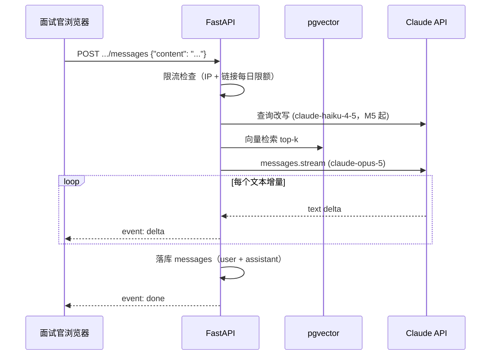

# 06 - API 设计

> 本文档定义 AskMyResume 后端全部 HTTP 端点的请求/响应约定与 SSE 事件格式。端点清单与 [00-blueprint.md](00-blueprint.md) §7 完全一致；数据字段含义见 [04-data-model.md](04-data-model.md)；RAG 管线内部逻辑见 [05-rag-pipeline.md](05-rag-pipeline.md)；前端如何消费这些接口见 [07-frontend.md](07-frontend.md)。

## 1. 全局约定

| 项 | 约定 |
|---|---|
| Base path | 所有端点以 `/api/v1` 为前缀 |
| 认证方式 | 请求头 `Authorization: Bearer <JWT>`（公开端点除外，凭 URL 中的 share link token） |
| 请求/响应体 | JSON（`application/json`），仅简历上传用 `multipart/form-data`，仅提问端点响应用 `text/event-stream` |
| ID | 一律为 UUID 字符串，如 `"6f1c9a2e-8d4b-4e2a-9c3f-0a1b2c3d4e5f"` |
| 时间 | ISO 8601 带时区，如 `"2026-07-26T10:30:00Z"`；可为空的时间字段用 `null` |
| 命名 | 字段名 snake_case，与数据库列名保持一致 |

### 1.1 统一错误响应

所有错误响应体为 FastAPI 默认风格：

```json
{"detail": "Resume not found"}
```

`detail` 通常是字符串；422 参数校验错误时为 FastAPI/Pydantic 生成的错误对象数组，前端按数组处理即可。

### 1.2 错误码表

| 状态码 | 含义 | 典型场景 |
|---|---|---|
| 400 | 请求不合法 | 文件类型不在白名单、文件超过 10MB、发布时没有任何 public section |
| 401 | 未认证 | 缺少/过期/伪造的 JWT |
| 403 | 无权限 | 访问他人资源 |
| 404 | 不存在 | 资源 ID 不存在、token 不存在（撤销/过期的 token 也可返回 404，避免泄露"曾经存在"） |
| 409 | 状态冲突 | 邮箱已注册；简历正在解析中重复触发 extract |
| 422 | 参数校验失败 | 请求体字段缺失/类型错误（FastAPI 自动生成） |
| 429 | 触发限流 | 公开对话端点超出 IP 或链接每日限额，见 §7 |
| 500 | 服务器内部错误 | 未捕获异常、LLM/embedding 调用失败且无法恢复 |

### 1.3 分页约定

仅 Owner 侧的对话记录列表需要分页，采用最简单的 `limit + offset` 查询参数：

- `limit`：默认 20，最大 100
- `offset`：默认 0

响应格式统一为 `{"items": [...], "total": 123, "limit": 20, "offset": 0}`。学习项目数据量小，不做游标分页。

### 1.4 健康检查

`GET /api/v1/health`：无认证，返回 `200 {"status": "ok"}`，供部署健康检查使用（[11-deployment.md](11-deployment.md) 已引用）。

## 2. 端点总览

| 分组 | 方法与路径 | 认证 |
|---|---|---|
| 认证 | `POST /api/v1/auth/register` | 否 |
| 认证 | `POST /api/v1/auth/login` | 否 |
| 认证 | `GET /api/v1/auth/me` | JWT |
| 认证 | `PATCH /api/v1/auth/me` | JWT |
| 简历 | `POST /api/v1/resumes` | JWT |
| 简历 | `GET /api/v1/resumes` | JWT |
| 简历 | `GET /api/v1/resumes/{id}` | JWT |
| 简历 | `DELETE /api/v1/resumes/{id}` | JWT |
| 简历 | `POST /api/v1/resumes/{id}/extract` | JWT |
| 档案 | `GET /api/v1/profile` | JWT |
| 档案 | `POST /api/v1/profile/sections` | JWT |
| 档案 | `PUT /api/v1/profile/sections/{section_id}` | JWT |
| 档案 | `DELETE /api/v1/profile/sections/{section_id}` | JWT |
| 档案 | `POST /api/v1/profile/publish` | JWT |
| 档案 | `GET /api/v1/profile/versions` | JWT |
| 分享链接 | `POST /api/v1/share-links` | JWT |
| 分享链接 | `GET /api/v1/share-links` | JWT |
| 分享链接 | `DELETE /api/v1/share-links/{id}` | JWT |
| 对话记录 | `GET /api/v1/conversations` | JWT |
| 对话记录 | `GET /api/v1/conversations/{id}/messages` | JWT |
| 公开 | `GET /api/v1/public/{token}` | 否（token 即凭证） |
| 公开 | `POST /api/v1/public/{token}/conversations` | 否 |
| 公开 | `POST /api/v1/public/{token}/conversations/{conversation_id}/messages` | 否，SSE 响应 |
| 杂项 | `GET /api/v1/health` | 否 |

## 3. 认证端点

### 3.1 POST /api/v1/auth/register

注册。请求体：

```json
{"email": "alice@example.com", "password": "at-least-8-chars", "nickname": "Alice"}
```

成功 `201`：

```json
{"id": "6f1c9a2e-...", "email": "alice@example.com", "nickname": "Alice", "created_at": "2026-07-26T10:30:00Z"}
```

错误：`409` 邮箱已注册；`422` 邮箱格式/密码长度不合法。响应不含 `password_hash`。

### 3.2 POST /api/v1/auth/login

登录。请求体 `{"email": "...", "password": "..."}`。成功 `200`：

```json
{"access_token": "eyJhbGciOiJIUzI1NiIs...", "token_type": "bearer", "expires_in": 86400}
```

JWT 有效期 24h（见 [08-security-privacy.md](08-security-privacy.md)），过期后重新登录。错误：`401` 邮箱或密码错误（统一提示，不区分哪个错）。

### 3.3 GET /api/v1/auth/me

返回当前登录用户，结构同注册响应。错误：`401`。

### 3.4 PATCH /api/v1/auth/me

修改昵称。需认证，请求体：

```json
{"nickname": "Alice"}
```

成功 `200`，返回更新后的用户对象，结构同 `GET /auth/me`。错误：`401`；`422` 昵称为空或类型错误。

## 4. 简历端点

### 4.1 POST /api/v1/resumes（重点）

上传简历文件。请求为 `multipart/form-data`，单一字段 `file`。

**校验规则**（不通过则 `400`，不落盘）：

| 规则 | 值 |
|---|---|
| 扩展名白名单 | `.pdf` / `.docx` / `.md` / `.txt` |
| MIME 白名单 | `application/pdf`、`application/vnd.openxmlformats-officedocument.wordprocessingml.document`、`text/markdown`、`text/plain` |
| 大小上限 | 10MB（10 * 1024 * 1024 bytes） |

校验通过后：文件写入 `data/uploads/{user_id}/`，创建 `resumes` 行（`parse_status="pending"`），用 FastAPI `BackgroundTasks` 异步解析文本。上传接口**立即返回**，前端轮询 `GET /resumes/{id}` 观察解析状态。

成功 `201`：

```json
{
  "id": "8a2b...",
  "filename": "resume_2026.pdf",
  "mime_type": "application/pdf",
  "size_bytes": 348160,
  "parse_status": "pending",
  "error_message": null,
  "created_at": "2026-07-26T10:31:00Z"
}
```

`parse_status` 枚举：`pending / parsing / succeeded / failed`。失败时（如扫描件无文字层，见 blueprint §3 不做 OCR）`parse_status="failed"` 且 `error_message` 给出可读原因。响应不含 `raw_text` 与 `storage_path`。

### 4.2 GET /api/v1/resumes

当前用户的简历列表（数量少，不分页）：`{"items": [ ...同上结构... ]}`。

### 4.3 GET /api/v1/resumes/{id}

单个简历详情，结构同 4.1 响应。前端用它轮询 `parse_status`。支持可选查询参数 `?include=raw_text`：默认响应不含 `raw_text` 与 `storage_path`；Owner 本人带该参数请求时，响应额外返回 `raw_text`。错误：`404` 不存在或不属于当前用户（统一 404，不泄露存在性）。

### 4.4 DELETE /api/v1/resumes/{id}

删除简历记录与磁盘文件。成功 `204` 无响应体。错误：`404`。

### 4.5 POST /api/v1/resumes/{id}/extract

触发 LLM 结构化抽取（`claude-opus-5` + `messages.parse` + Pydantic schema，细节见 [05-rag-pipeline.md](05-rag-pipeline.md)），结果写入/合并到档案草稿的 `profile_sections`。同样用 `BackgroundTasks` 异步执行。

请求体可为空。若该用户已有非空档案草稿且请求未带 `mode`，重复抽取需人工确认覆盖（blueprint §12）：返回 `409 {"detail": "profile draft exists, confirm overwrite"}`，前端弹窗确认后重发请求并携带：

```json
{"mode": "overwrite"}
```

成功 `202`：

```json
{"resume_id": "8a2b...", "extract_status": "running"}
```

前端通过 `GET /api/v1/profile` 轮询抽取产物是否就绪。错误：`400` 简历尚未解析成功（`parse_status != "succeeded"`）；`409` 已有非空档案草稿待确认覆盖（如上），或抽取正在进行中——两种 `409` 通过 `detail` 文本区分；`404`。

## 5. 档案端点

### 5.1 GET /api/v1/profile（重点）

返回当前用户的档案及**全部** sections（草稿态，含 `hidden`）。用户首次调用时若档案不存在则自动创建空 `draft` 档案，因此本端点对已登录用户不返回 404。

成功 `200`：

```json
{
  "id": "3c9d...",
  "status": "draft",
  "current_version_id": null,
  "updated_at": "2026-07-26T11:02:00Z",
  "sections": [
    {
      "id": "b1e4...",
      "section_type": "basic_info",
      "content": {"name": "张三", "city": "上海", "years_of_experience": 5, "job_intention": "后端工程师"},
      "sort_order": 0,
      "visibility": "public",
      "updated_at": "2026-07-26T11:02:00Z"
    },
    {
      "id": "c2f5...",
      "section_type": "contact",
      "content": {"email": "zhangsan@example.com", "github": "https://github.com/zhangsan"},
      "sort_order": 1,
      "visibility": "hidden",
      "updated_at": "2026-07-26T11:02:00Z"
    },
    {
      "id": "d3a6...",
      "section_type": "work_experience",
      "content": {"entries": [{"company": "某科技公司", "title": "高级后端工程师", "start": "2023-01", "end": null, "highlights": ["..."]}]},
      "sort_order": 4,
      "visibility": "public",
      "updated_at": "2026-07-26T11:05:00Z"
    }
  ]
}
```

`section_type` 为 blueprint §5 的十个枚举值之一；`content` 为 JSONB，各 `section_type` 的具体结构定义在 [04-data-model.md](04-data-model.md)。`sections` 按 `sort_order` 升序返回。

### 5.2 POST /api/v1/profile/sections

新增 section（主要用于 `custom` 维度，或补建抽取时缺失的维度）。请求体：

```json
{"section_type": "custom", "content": {"title": "开源贡献", "text": "..."}, "visibility": "public"}
```

成功 `201`，返回完整 section 对象（结构同 5.1 中的元素），`sort_order` 由后端追加到末尾。错误：`409` 非 `custom` 类型且该类型已存在（每种非 custom 维度至多一条）；`422` `section_type` 不在枚举内。

### 5.3 PUT /api/v1/profile/sections/{section_id}

整体更新一个 section 的 `content` / `visibility` / `sort_order`（全量替换语义，前端提交编辑后的完整 content）。请求体为上述三个字段的任意子集，成功 `200` 返回更新后的 section 对象。错误：`404`；`422`。

对草稿的修改不影响已发布版本——面试官看到的始终是最近一次 publish 的快照。

### 5.4 DELETE /api/v1/profile/sections/{section_id}

删除 section。成功 `204`。错误：`404`。

### 5.5 POST /api/v1/profile/publish（重点）

发布档案。请求体为空。行为（**同步操作**，快照、切分、embedding、写入 `profile_chunks` 与回填 `current_version_id` 在同一个数据库事务内完成，任一步失败整体回滚）：

1. 将全部 `visibility="public"` 的 sections 序列化为 `snapshot`（JSONB），写入 `profile_versions`，`version_no` 自增（1, 2, 3, ...）；`hidden` 维度物理不入快照。
2. 对快照中的维度按条目切 chunk → bge-m3 计算 embedding → 写入 `profile_chunks`（详见 [05-rag-pipeline.md](05-rag-pipeline.md)）。
3. 更新 `profiles.status="published"`、`current_version_id` 指向新版本。

档案规模小（几十个 chunk，本地 embedding），同步执行通常在几秒内完成，学习项目不引入任务队列（blueprint §12）；前端按钮显示 loading 即可。

成功 `201`：

```json
{"version_id": "e5c7...", "version_no": 3, "published_at": "2026-07-26T12:00:00Z", "chunk_count": 14}
```

错误：`400` 没有任何 `public` section（发布出去也无内容可检索）；`500` embedding 计算失败（事务回滚，旧版本仍然有效）。

### 5.6 GET /api/v1/profile/versions

版本列表（不含 `snapshot` 大字段）：

```json
{"items": [{"id": "e5c7...", "version_no": 3, "published_at": "2026-07-26T12:00:00Z"}]}
```

## 6. 分享链接与对话记录（Owner 侧）

### 6.1 POST /api/v1/share-links

请求体（均可选）：

```json
{"label": "投给 A 公司", "expires_at": "2026-08-31T00:00:00Z", "daily_question_limit": 30}
```

成功 `201`：

```json
{
  "id": "f6d8...",
  "token": "Xy3kP9qLmN2vR8sT-Uv7wQ",
  "url": "https://your-domain.example/chat/Xy3kP9qLmN2vR8sT-Uv7wQ",
  "label": "投给 A 公司",
  "expires_at": "2026-08-31T00:00:00Z",
  "revoked_at": null,
  "daily_question_limit": 30,
  "created_at": "2026-07-26T12:05:00Z"
}
```

`token` 由后端 `secrets.token_urlsafe(16)` 生成（22 字符）；`url` 为方便前端复制拼好的对话页地址，由环境变量 `FRONTEND_BASE_URL` 拼接（见 [11-deployment.md](11-deployment.md)）。错误：`400` 档案从未发布过（无内容可分享）。

### 6.2 GET /api/v1/share-links

当前用户全部链接（含已撤销的，前端标灰展示）：`{"items": [...]}`，元素结构同上。

### 6.3 DELETE /api/v1/share-links/{id}

撤销链接：置 `revoked_at`，**立即失效**，不物理删除（保留其下对话记录）。成功 `204`。错误：`404`。

### 6.4 GET /api/v1/conversations

面试官会话列表，支持 §1.3 分页，可选查询参数 `share_link_id` 过滤：

```json
{
  "items": [
    {"id": "a7e9...", "share_link_id": "f6d8...", "share_link_label": "投给 A 公司", "visitor_id": "9b0c...", "started_at": "2026-07-26T14:00:00Z", "message_count": 6}
  ],
  "total": 1, "limit": 20, "offset": 0
}
```

### 6.5 GET /api/v1/conversations/{id}/messages

某会话的消息记录，按时间升序，支持分页：

```json
{
  "items": [
    {"id": "m1..", "role": "user", "content": "他主导过什么项目？", "retrieved_chunk_ids": null, "input_tokens": null, "output_tokens": null, "created_at": "2026-07-26T14:00:05Z"},
    {"id": "m2..", "role": "assistant", "content": "根据档案，他主导过……", "retrieved_chunk_ids": ["c01..", "c02..", "c03.."], "input_tokens": 1830, "output_tokens": 254, "created_at": "2026-07-26T14:00:09Z"}
  ],
  "total": 6, "limit": 50, "offset": 0
}
```

`retrieved_chunk_ids` 与 token 用量帮助 Owner（也是学习者本人）回看每次检索命中了什么、花了多少 token——这是 [10-testing-evaluation.md](10-testing-evaluation.md) 中人工评估的原始素材。

## 7. 公开端点（免登录）

三个端点均以 `token` 为凭证。token 校验统一规则：不存在、已撤销、已过期一律返回 `404 {"detail": "Share link not found"}`，不区分原因，避免探测。均受 IP 级限流保护（见 §9）。

### 7.1 GET /api/v1/public/{token}

档案公开摘要，供对话页首屏渲染。成功 `200`：

```json
{
  "nickname": "Alice",
  "headline": "后端工程师 · 5 年经验 · 上海",
  "visible_section_types": ["basic_info", "summary", "education", "work_experience", "projects", "skills"],
  "published_at": "2026-07-26T12:00:00Z"
}
```

- `headline` 由已发布快照中 `basic_info` 的求职意向/年限/城市拼接而成，可能为 `null`。
- `visible_section_types` 仅列出快照中 `visibility="public"` 的维度类型，提示面试官"可以问哪些方面"。
- **绝不返回** `user_id`、`email`、`profile_id` 等内部标识（blueprint §9）；`contact` 默认 hidden，因此默认不出现。

### 7.2 POST /api/v1/public/{token}/conversations

创建会话。`visitor_id` 是浏览器端 `crypto.randomUUID()` 生成的匿名 UUID，存于 localStorage，经请求体传入，用于将同一面试官的多个会话归组。

请求体：

```json
{"visitor_id": "9b0c..."}
```

成功 `201`：

```json
{"conversation_id": "a7e9...", "visitor_id": "9b0c...", "started_at": "2026-07-26T14:00:00Z"}
```

错误：`429` 超出链接级每日新建会话上限（20 个/链接/UTC 日，M6 实现，见 §9）。

### 7.3 POST /api/v1/public/{token}/conversations/{conversation_id}/messages（SSE，重点）

面试官提问，响应为 SSE 流。请求体：

```json
{"content": "他最近一段工作经历做了什么？"}
```

校验：`content` 非空且 ≤ 500 字符（超限 `422`）；`conversation_id` 必须属于该 token（否则 `404`）。响应头：

```
Content-Type: text/event-stream
Cache-Control: no-cache
X-Accel-Buffering: no
```

服务端流程（详见 [05-rag-pipeline.md](05-rag-pipeline.md)）：查询改写（`claude-haiku-4-5`，M5 起；M4 直接用原始问题检索）→ pgvector 检索 → `claude-opus-5` 经 `client.messages.stream(...)` 流式生成，每个文本增量转发为一条 `delta` 事件。



## 8. SSE 事件格式（全局统一）

每条事件由 `event:` 行与 `data:` 行组成，`data` 为单行 JSON，事件间以空行分隔。共三种事件加心跳注释：

```
event: delta
data: {"text": "根据档案，"}

event: delta
data: {"text": "他最近一段工作经历是……"}

: ping

event: done
data: {"message_id": "m2..", "retrieved_chunk_ids": ["c01..", "c02..", "c03.."]}
```

| 事件 | data 结构 | 说明 |
|---|---|---|
| `delta` | `{"text": "..."}` | 回答的文本增量，前端按序拼接渲染 |
| `done` | `{"message_id": "...", "retrieved_chunk_ids": ["..."]}` | 正常结束，唯一的终止事件之一；此时 assistant 消息已落库 |
| `error` | `{"detail": "..."}` | 流中途出错（如 Claude 调用失败、`stop_reason` 为 `"refusal"`）；发出后服务端关闭流 |

- **心跳**：检索与首 token 等待期间，每 15 秒发送一行 SSE 注释 `: ping`（无 `event`/`data`），防止代理超时断连，前端忽略即可。
- 每个流以 `done` 或 `error` 恰好其一结束；前端收到任一即关闭连接（消费方式见 [07-frontend.md](07-frontend.md)）。
- 进入流之前就能判定的错误（限流、404、422）以普通 JSON 错误响应返回，**不会**进入 SSE。

## 9. 限流响应（429）

公开对话端点双重限流（blueprint §9），任一触发即返回 `429` + `Retry-After` 头：

| 层级 | 实现 | 默认阈值 | Retry-After | 落地里程碑 |
|---|---|---|---|---|
| IP 级 | slowapi，按客户端 IP | 提问 10 次/分钟；创建会话 5 次/分钟 | 秒数，如 `Retry-After: 42` | M6 |
| 链接级（提问数） | 统计该 `share_link_id` 当日（UTC）user 消息数，达到 `daily_question_limit`（默认 30）拒绝 | 30 问/链接/天 | 距 UTC 次日零点的秒数 | M4 |
| 链接级（会话数） | 统计该 `share_link_id` 当日（UTC）新建会话数，达到上限拒绝（`429`） | 20 个新会话/链接/天 | 距 UTC 次日零点的秒数 | M6 |

```
HTTP/1.1 429 Too Many Requests
Retry-After: 42

{"detail": "Rate limit exceeded. Try again later."}
```

链接级触发时 `detail` 为 `"Daily question limit reached for this link."`，前端据此提示面试官"今日提问额度已用完"。IP 级限流对 `GET /api/v1/public/{token}` 也生效（宽松阈值即可）；登录端点另有轻量 IP 限流防爆破，见 [08-security-privacy.md](08-security-privacy.md)。

## 10. 实现备注

- 路由按 blueprint §10 的 `backend/app/api/` 目录组织：`auth.py`、`resumes.py`、`profile.py`、`share_links.py`、`conversations.py`、`public.py`，一一对应本文档的分组。
- 请求/响应模型集中在 `backend/app/schemas/`（Pydantic），FastAPI 自动生成 OpenAPI 文档（`/docs`），可直接当本文档的可执行版使用。
- 所有 Owner 端点在依赖注入层（`core/deps.py`）完成 JWT 解析与资源归属校验；公开端点在同层完成 token 校验与限流，业务代码不重复写鉴权。
