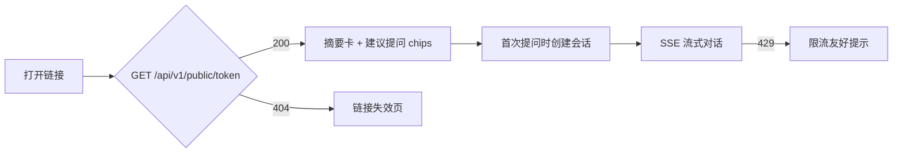

# 07 - 前端设计

> 本文档定义 AskMyResume 前端的页面、组件拆分、状态管理与 SSE 消费方式。API 端点与响应结构以 [06-api-design.md](06-api-design.md) 为准，总体决策以 [00-blueprint.md](00-blueprint.md) 为准。

## 1. 技术基础

- **框架**：Next.js 15（App Router）+ TypeScript（blueprint §3）。
- **样式与组件库**：Tailwind CSS + shadcn/ui。shadcn/ui 按需复制组件源码进仓库，无运行时依赖负担，本项目主要用到：`Button`、`Card`、`Input`、`Textarea`、`Switch`、`Dialog`、`Badge`、`Tabs`、`Sonner`（toast）。
- **渲染策略：client component 为主**。本项目所有页面都是强交互（上传轮询、表单编辑、SSE 流式聊天），且没有 SEO 需求——公开对话页通过私密链接分发，本就不希望被搜索引擎收录。因此不刻意追求 server component / RSC 数据流，每个页面顶层即 `"use client"`，用浏览器端 fetch 调 FastAPI。App Router 在这里主要提供文件路由、layout 嵌套与动态段（`chat/[token]`）能力。

目录结构（对应 blueprint §10 的 `frontend/app/`）：

```
frontend/
├── app/
│   ├── (auth)/login/page.tsx        # 未登录布局组
│   ├── (auth)/register/page.tsx
│   ├── (owner)/layout.tsx           # 登录守卫 + 侧边导航
│   ├── (owner)/dashboard/page.tsx
│   ├── (owner)/profile/page.tsx
│   ├── (owner)/share/page.tsx
│   ├── (owner)/conversations/page.tsx
│   ├── chat/[token]/page.tsx        # 公开对话页，免登录
│   └── layout.tsx
├── components/                      # 页面级组件（SectionCard、ChatWindow 等）
└── lib/                             # api.ts(fetch wrapper)、sse.ts、swr hooks
```

## 2. 路由与页面清单

| 路由 | 认证 | 功能 |
|---|---|---|
| `/login`、`/register` | 无 | 邮箱+密码登录/注册 |
| `/dashboard` | Owner | 简历上传、解析状态轮询、触发抽取 |
| `/profile` | Owner | 档案按维度编辑、visibility 开关、发布 |
| `/share` | Owner | 分享链接的创建/复制/撤销 |
| `/conversations` | Owner | 面试官对话记录回看 |
| `/chat/[token]` | 免登录 | 面试官与档案 RAG 对话 |

`(owner)` 布局组的 `layout.tsx` 是客户端守卫：挂载时检查 localStorage 中是否有 JWT，没有则 `router.replace("/login")`。因为 token 存在 localStorage（见 §4），Next.js middleware 读不到，所以不用 middleware 做路由保护——学习项目接受"闪一下再跳转"的体验。

### 2.1 /login、/register

- **组件**：`AuthForm`（email、password 输入 + 提交按钮），两页复用。
- **交互**：调 `POST /api/v1/auth/register` / `POST /api/v1/auth/login`；成功后把返回的 JWT 写入 localStorage 并跳转 `/dashboard`。409（邮箱已注册）、401（密码错误）在表单内联提示。

### 2.2 /dashboard（简历上传与解析）

- **功能**：上传简历文件，观察解析状态，解析成功后触发 LLM 抽取并引导去 `/profile` 审阅。
- **组件拆分**：`UploadDropzone`（拖拽/点击选文件）+ `ResumeList`（`ResumeItem` 列表，状态 Badge：pending/parsing/succeeded/failed）。
- **关键交互**：
  - 上传前在客户端预检类型白名单（PDF/DOCX/MD/TXT）与 10MB 上限，不合法直接提示，省一次 400 往返（服务端仍会校验，见 06 §1.2）。
  - `POST /api/v1/resumes`（multipart）后拿到 `id`，进入**轮询模式**（见 §5.2）直到 `parse_status` 为 `succeeded/failed`；failed 时展示 `error_message`（如扫描件无文字层）。
  - succeeded 后显示"抽取到档案"按钮 → `POST /api/v1/resumes/{id}/extract`；409 按 `detail` 文本分流：抽取进行中的 409 置灰按钮；`detail` 为 `profile draft exists, confirm overwrite`（已有非空档案草稿）时弹确认 `Dialog`（"已有档案草稿，重新抽取将覆盖，是否继续？"），确认后带 `{"mode": "overwrite"}` 重发请求；抽取期间轮询 `GET /api/v1/profile` 观察 sections 是否就绪，就绪后 toast 引导跳转 `/profile`。

### 2.3 /share（分享链接管理）

- **组件**：`CreateLinkDialog`（label、expires_at、daily_question_limit 三个可选字段）+ `LinkTable`。
- **交互**：创建成功后直接展示响应中的 `url` 并提供一键复制；列表含已撤销链接（标灰）；撤销按钮调 `DELETE /api/v1/share-links/{id}` 前弹确认框，提示"撤销后链接立即失效，但对话记录保留"。档案从未发布时创建返回 400，前端提示"请先在档案页发布"。

### 2.4 /conversations（对话记录回看）

- **组件**：`ConversationList`（分页，支持按 share_link 过滤）+ `ConversationDetail`（消息流）。
- **交互**：点开会话调 `GET /api/v1/conversations/{id}/messages`；assistant 消息下方可展开 `retrieved_chunk_ids` 与 input/output token 用量——这是 [10-testing-evaluation.md](10-testing-evaluation.md) 人工评估 RAG 效果的入口，属于本项目的学习功能而非装饰。

### 2.5 /chat/[token]（公开对话页）

详见 §7。核心组件：`CandidateSummaryCard`、`SuggestionChips`、`ChatWindow`（`MessageBubble` 列表 + `ChatInput`）。

## 3. 档案编辑页 /profile（设计重点）

页面按 `section_type`（blueprint §5 的十个枚举值）分卡片渲染，`sort_order` 排序。`content` 是 JSONB，各类型结构见 [04-data-model.md](04-data-model.md)，前端按内容形态分三类编辑器：

| 内容形态 | section_type | 编辑器组件 |
|---|---|---|
| 单对象 | `basic_info`、`contact` | `ObjectForm`：固定字段表单 |
| 单段文本 / 字符串列表 | `summary`、`hobbies`、`custom` | `TextEditor` / `TagListEditor` |
| 条目列表 | `education`、`work_experience`、`projects`、`certificates`、`skills`（按分组） | `EntryListEditor`：增删改 + 排序 |

```mermaid
flowchart TD
    P[ProfilePage] --> H[PublishBar 发布栏]
    P --> L[SectionCard × N 按 sort_order]
    L --> V[VisibilitySwitch public/hidden]
    L --> E{内容形态}
    E -->|单对象| F[ObjectForm]
    E -->|条目列表| EL[EntryListEditor]
    EL --> EI[EntryItem 展开编辑 / 删除 / 上移下移]
    EL --> ADD[新增条目]
```



- **条目型维度**：条目默认折叠显示标题行（如"某科技公司 · 高级后端工程师 · 2023.01-至今"），点击展开为表单编辑。增删改排序都只改本地 state，点卡片右上角"保存"时把**编辑后的完整 content** 通过 `PUT /api/v1/profile/sections/{section_id}` 全量提交（06 §5.3 是全量替换语义，不做条目级 API）。排序用上移/下移按钮即可，不引入拖拽库——学习项目砍掉非核心复杂度。
- **单对象型**：`basic_info`/`contact` 为固定字段表单，同样整体保存。
- **visibility 开关**：每张卡片头部一个 `Switch`，切换即时调 `PUT` 保存（无需点保存按钮）。`contact` 卡片默认 hidden 并附一行说明"隐藏维度不入索引、面试官不可见"（blueprint §5、§9）。
- **新增维度**：抽取可能缺失某些维度，或用户想加 `custom` 补充。"添加维度"按钮列出尚不存在的 section_type（非 custom 类型每种至多一条，06 §5.2 的 409 约束前端提前规避）+ 可重复添加的 `custom`，调 `POST /api/v1/profile/sections`。
- **发布栏（PublishBar）**：页面顶部常驻，展示三种状态：
  1. 从未发布（`status="draft"` 且 `current_version_id=null`）："尚未发布，面试官无法访问"；
  2. 已发布且无新修改："当前版本 v{version_no}，发布于 {published_at}"；
  3. 已发布但有未发布修改（任一 section 的 `updated_at` 晚于最近版本 `published_at`）："有未发布的修改"高亮提示。
  点"发布"调 `POST /api/v1/profile/publish`。发布是同步操作（快照 + chunk + embedding，几秒内完成，06 §5.5），按钮显示 loading 即可；成功后 toast 展示 `version_no` 与 `chunk_count`；400（无任何 public section）提示"至少要有一个可见维度"。

## 4. 认证与 API 调用

**JWT 存 localStorage**。这是学习项目的明确取舍：实现最简单（不用处理 cookie 域、CSRF），代价是 XSS 可窃取 token。接受该风险的理由与缓解（依赖 React 默认转义、不用 `dangerouslySetInnerHTML`、24h 短有效期）见 [08-security-privacy.md](08-security-privacy.md)。

所有请求走统一的 fetch wrapper（`lib/api.ts`），自动带 `Authorization`，401 统一跳登录：

```ts
export async function api<T>(path: string, init: RequestInit = {}): Promise<T> {
  const token = localStorage.getItem("jwt");
  const res = await fetch(`${process.env.NEXT_PUBLIC_API_BASE}${path}`, {
    ...init,
    headers: {
      ...(init.body instanceof FormData ? {} : { "Content-Type": "application/json" }),
      ...(token ? { Authorization: `Bearer ${token}` } : {}),
      ...init.headers,
    },
  });
  if (res.status === 401) {           // token 缺失/过期/伪造
    localStorage.removeItem("jwt");
    window.location.href = "/login";
    throw new Error("unauthorized");
  }
  if (!res.ok) throw new ApiError(res.status, (await res.json()).detail);
  return res.status === 204 ? (undefined as T) : res.json();
}
```

公开对话页的请求不带 `Authorization`，且 401 跳转逻辑对其不适用——`/chat/[token]` 直接用原生 fetch 或传入 `skipAuth` 标志。

## 5. 状态管理与数据获取

### 5.1 结论：React state + SWR，不引入重型方案

本项目没有复杂的跨页面共享状态（唯一的"全局状态"是 JWT，放 localStorage 已足够），Redux/Zustand 都是多余的。服务端数据缓存在 SWR 与 TanStack Query 之间**选 SWR**：两者能力对本项目都过剩，SWR API 面更小（一个 `useSWR` hook 覆盖本项目 90% 场景）、心智负担低，且 `refreshInterval` 支持按最新数据动态返回间隔，正好实现解析轮询。TanStack Query 的优势（复杂 mutation 管理、乐观更新、无限滚动）本项目用不上。页面内的表单编辑态一律用普通 `useState`。

### 5.2 解析状态轮询模式（dashboard）

上传后每 2s 轮询 `GET /api/v1/resumes/{id}`，直到 `parse_status` 进入终态：

```ts
const { data: resume } = useSWR(
  id ? `/api/v1/resumes/${id}` : null,
  api,
  {
    refreshInterval: (latest) =>
      latest && ["succeeded", "failed"].includes(latest.parse_status) ? 0 : 2000,
  },
);
```

返回 `0` 即停止轮询。同样的模式复用于抽取完成检测（轮询 `GET /api/v1/profile` 直到相关 sections 出现）。学习项目用轮询而非 WebSocket 推送，与后端 `BackgroundTasks` 的极简异步方案（blueprint §12）对齐。

## 6. SSE 消费模式（对话流式输出）

提问端点是 `POST /api/v1/public/{token}/conversations/{conversation_id}/messages`（06 §7.3）。浏览器原生 `EventSource` **只支持 GET**，无法携带请求体，因此用 `fetch` + `ReadableStream` 手动解析 SSE——这也是 blueprint §3 的既定决策。事件格式（`delta` / `done` / `error` + `: ping` 心跳）全局定义在 [06-api-design.md](06-api-design.md) §8。

关键解析代码（`lib/sse.ts`）——按空行切分事件块，逐块解析 `event:`/`data:` 行：

```ts
export async function consumeSSE(
  res: Response,
  on: { delta: (t: string) => void; done: (d: DoneData) => void; error: (msg: string) => void },
) {
  const reader = res.body!.getReader();
  const decoder = new TextDecoder();
  let buf = "";
  for (;;) {
    const { done, value } = await reader.read();
    if (done) break;
    buf += decoder.decode(value, { stream: true });
    const blocks = buf.split("\n\n");
    buf = blocks.pop()!;                        // 末段可能不完整，留到下一轮
    for (const block of blocks) {
      let event = "", data = "";
      for (const line of block.split("\n")) {
        if (line.startsWith("event:")) event = line.slice(6).trim();
        else if (line.startsWith("data:")) data = line.slice(5).trim();
        // 以 ":" 开头的心跳注释行（": ping"）直接忽略
      }
      if (event === "delta") on.delta(JSON.parse(data).text);
      else if (event === "done") on.done(JSON.parse(data));
      else if (event === "error") on.error(JSON.parse(data).detail);
    }
  }
}
```

配套的 UI 行为：

- **打字机渲染**：`delta.text` 追加到当前 assistant 消息的 state 上，React 逐次重渲染即天然的打字机效果，无需逐字符定时器。消息区维护 `scrollIntoView` 跟随，但用户手动上滚后暂停自动跟随。
- **生成中断**：发起 fetch 时创建 `AbortController`，输入框旁的"停止"按钮调 `controller.abort()` 关闭连接；已渲染的部分文本保留并标注"已停止生成"。注意：中断只是前端断开，后端是否落库半截回答属于后端行为，前端不做假设，下次加载对话记录以服务端为准。
- **error 事件**：流中途出错（Claude 调用失败、`stop_reason` 为 `"refusal"` 等）收到 `error` 后，把 `detail` 渲染为该条消息位置的错误气泡，并允许重新发送同一问题。每个流以 `done` 或 `error` 恰好其一结束，前端收到任一即释放"生成中"状态、恢复输入框。
- 进入流之前的错误（429/404/422）是普通 JSON 响应，在调 `consumeSSE` 前检查 `res.ok` 分流处理（见 §7）。

## 7. 公开对话页 /chat/[token] UX



- **visitor_id**：浏览器侧的匿名标识 UUID，用于把同一面试官的多个会话归组（对应 `conversations.visitor_id`）。首次访问时 `crypto.randomUUID()` 生成并存 localStorage，创建会话时放入请求体——单一通道，不用 cookie，也不做指纹等重识别手段。
- **首屏摘要卡（CandidateSummaryCard）**：进入页面先调 `GET /api/v1/public/{token}` 渲染候选人 `nickname`、`headline` 与 `visible_section_types`（映射为中文维度名，如"工作经历、项目经历、技能"），让面试官知道"能问什么"。
- **建议提问 chips（SuggestionChips）**：空会话状态下展示 3-5 个前端**静态预置**的示例问题（按 `visible_section_types` 过滤，如有 `work_experience` 才显示"介绍一下最近一段工作经历"），点击即作为提问发送。纯前端逻辑，不调 LLM 生成，控制成本与复杂度。
- **会话创建时机**：懒创建——首次点击发送时才调 `POST /api/v1/public/{token}/conversations`，拿到 `conversation_id` 后发消息；`conversation_id` 存内存（刷新即新会话，学习项目不做会话恢复）。
- **限流 429 的友好提示**：读 06 §9 的响应区分两种文案——`detail` 为链接级限额时提示"该链接今日提问额度已用完，请明天再试"；否则按 `Retry-After` 头提示"提问太频繁，请 {n} 秒后重试"并对发送按钮做倒计时禁用。不展示原始报错。
- **链接失效/撤销页面**：`GET /api/v1/public/{token}` 返回 404 时（不存在/已撤销/已过期统一 404，不区分原因，06 §7.1 前置约定）渲染整页提示："链接不存在或已失效，请联系候选人获取新链接"。对话中途被撤销时，下一次提问的 404 也导航到同一提示。
- 输入框限 500 字符（与后端校验一致），超限禁用发送并显示计数。

### 7.1 公开页安全渲染（防收录、token 防泄露与 XSS）

- **防收录与 token 防泄露**：公开页 `head` 加 `<meta name="robots" content="noindex, nofollow">`——私密链接本就不希望被搜索引擎收录（见 §1 的渲染策略）；同时设置 `Referrer-Policy: no-referrer`，避免面试官从对话页点击外链时，URL 中的 token 经 Referer 头泄露（呼应 [08-security-privacy.md](08-security-privacy.md)）。
- **回答渲染（XSS 防线）**：对话回答用 `react-markdown` 渲染（默认不解析 raw HTML）或直接纯文本渲染，禁用 `dangerouslySetInnerHTML`（与 §4 的缓解口径一致）——模型输出视为不可信内容，防止其中夹带的 HTML/脚本注入页面。

## 8. 与其他文档的边界

- API 请求/响应字段、SSE 事件与错误码：[06-api-design.md](06-api-design.md)。
- `content` JSONB 各维度的具体字段：[04-data-model.md](04-data-model.md)。
- localStorage 存 JWT 的风险分析、CORS 白名单：[08-security-privacy.md](08-security-privacy.md)。
- 各页面落在哪个里程碑（M1 登录/上传、M2 档案编辑、M4 对话页 MVP、M5 对话回看）：[09-roadmap.md](09-roadmap.md)。
