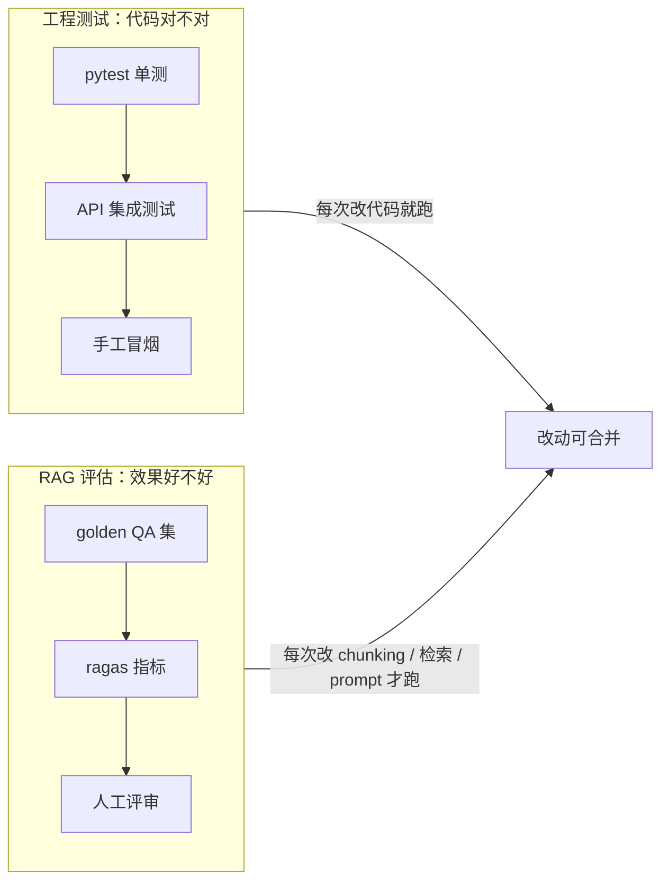
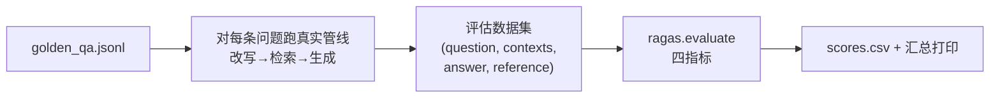
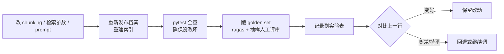

# 10 - 测试与评估

> 本文档定义 AskMyResume 的两条质量保障线：**工程测试**（保证代码对）与 **RAG 质量评估**（保证效果好）。前者覆盖 pytest 单测、API 集成测试与 mock 策略；后者把 [05-rag-pipeline.md](05-rag-pipeline.md) 中的评估设计落成可操作的 golden QA 集、ragas 脚本与回归工作流。所有决策以 [00-blueprint.md](00-blueprint.md) 为准。

## 0. 两条线，两个问题



关键区别：工程测试是**确定性**的（同样输入必须同样输出，跑得快、免费、随时跑）；RAG 评估是**统计性**的（答案质量靠指标和人打分，跑一次要调 LLM、有成本，按需跑）。两者不要混在一起——单测里绝不调真实 LLM API。

---

## A. 工程测试

### 1. 测试策略：学习项目版金字塔

| 层 | 做什么 | 不做什么 |
|---|---|---|
| 单测（多） | 纯逻辑函数：chunker、security、可见性过滤、限流计数 | 不给 ORM model / Pydantic schema 写"字段存在性"测试 |
| API 集成测试（适量） | 关键路径打真实 FastAPI app + 测试数据库 | 不穷举所有参数组合 |
| E2E（几乎不做） | 手工冒烟清单（见 §6） | 不引入 Playwright/Cypress 自动化 |

原则：**不追求覆盖率指标**。测试的目的是让重构 chunker、改检索参数时有底气，而不是刷绿色徽章。判断一个测试值不值得写：这段逻辑坏了会不会静默产出错误结果（如 hidden 维度进了索引）？会 → 写；只是接口报错、一眼能发现 → 靠集成测试或手工。

测试放 `backend/tests/`，结构镜像 `app/`：

```
backend/tests/
├── conftest.py          # fixtures: 测试 DB、AsyncClient、fake providers
├── unit/                # test_chunker.py, test_security.py, test_visibility.py, test_rate_limit.py
├── api/                 # test_auth.py, test_resumes.py, test_publish.py, test_public_chat.py
└── smoke/               # test_real_llm.py（标记 slow/manual，CI 不跑）
```

### 2. pytest 单测重点清单

#### 2.1 chunker（`app/rag/chunker.py`）——最值得测的模块

chunking 是 RAG 质量的地基，且是纯函数（`snapshot JSONB in → chunk 列表 out`），最好测。按 [00-blueprint.md](00-blueprint.md) §8 的切分规则逐条覆盖：

| 用例 | 断言 |
|---|---|
| `work_experience` 3 段经历 | 产出 3 个 chunk，`entry_index` 为 0/1/2 |
| `projects` 每个项目 1 chunk | 渲染文本含 `【项目经历】` 前缀、项目名、时间、技术栈 |
| `skills` 按分组切 | 2 个分组 → 2 个 chunk，各含分类名与技能项 |
| `basic_info` / `summary` / `hobbies` | 各自合并为 1 个 chunk |
| `contact` 且 `visibility=public` | 合并为 1 个 chunk；`visibility=hidden`（默认）→ 0 个 chunk |
| 任意 `visibility=hidden` 的维度 | 完全不产出 chunk（安全红线，见 [08-security-privacy.md](08-security-privacy.md)） |
| 模板渲染 | 空字段不渲染出 `None` / 空标签；chunk 文本长度落在 100-500 字目标区间（超长条目允许例外，但要有断言记录当前行为） |
| `custom` 维度 | 标题 + 自由文本正确进入渲染结果 |
| meta 字段 | 每个 chunk 的 `section_type`、`entry_index`、`meta` 与来源条目对得上（对话引用溯源靠它） |

技巧：在 `tests/unit/fixtures/` 放 1-2 份手工构造的 snapshot JSON（覆盖全部 section_type），比每个用例现场拼 dict 省事。

#### 2.2 security（`app/core/security.py`）

| 用例 | 断言 |
|---|---|
| argon2 哈希 | `verify(hash(pw), pw)` 为真；错误密码为假；两次 hash 同一密码结果不同（salt 生效） |
| JWT 编解码 | encode 后 decode 还原 `sub`（user_id）；篡改一位后 decode 抛异常 |
| token 过期 | 生成 `exp` 为过去时间的 token，decode 抛 `ExpiredSignatureError`（用 `freezegun` 或直接构造过期 payload，别 `sleep`） |
| 错误 secret | 用另一个 secret 签的 token 校验失败 |

#### 2.3 可见性过滤逻辑

发布快照与公开摘要两处都要过滤 hidden 维度（服务层函数，纯逻辑可单测）：

- 输入含 hidden 维度的 sections，公开摘要输出中该维度**不存在**（不是置空，是整个 key 消失）。
- 公开摘要不含 `user_id` / `email` 等内部标识（蓝图 §9）。

#### 2.4 每日限流计数

`share_links.daily_question_limit`（默认 30）的计数逻辑单测：

- 当日第 30 问放行、第 31 问拒绝；
- "当日"边界：跨天后计数归零（同样用时间冻结，不要依赖真实时钟）;
- 不同 share_link 计数互不影响。

slowapi 的 IP 级限流是库行为，不单测，集成测试里验证一个 429 分支即可。

### 3. API 集成测试

#### 3.1 基础设施

- **客户端**：`httpx.AsyncClient` + `ASGITransport(app=app)`，不起真实端口。
- **测试数据库**：优先方案——Docker Compose 里为测试单独起一个 pg 容器（同镜像，带 pgvector，别的端口）；简化方案——复用开发库但走独立的 `test` schema，每轮 session 建表、结束丢弃。两者都通过环境变量 `DATABASE_URL` 切换，代码零改动。集成测试用真 pg 而非 SQLite，因为要覆盖 `vector(1024)` 列与 JSONB 查询。
- **每用例隔离**：外层事务 + rollback，或 truncate 相关表，保证用例互不污染。

```python
# tests/conftest.py（关键片段）
@pytest.fixture
async def client(test_db):
    app.dependency_overrides[get_llm_client] = lambda: FakeLLMClient()
    app.dependency_overrides[get_embedding_provider] = lambda: FakeEmbeddingProvider()
    async with AsyncClient(transport=ASGITransport(app=app), base_url="http://test") as c:
        yield c
    app.dependency_overrides.clear()
```

#### 3.2 关键路径用例清单

| 组 | 用例 | 期望 |
|---|---|---|
| 认证 | 注册 → 登录 → `GET /api/v1/auth/me` | 拿到 JWT；me 返回本人信息 |
| 认证 | 重复邮箱注册；错误密码登录；无 token 访问 owner 端点 | 4xx；无 token → 401 |
| 简历 | `POST /api/v1/resumes` 上传 txt → 查 `parse_status` | `succeeded`，`raw_text` 非空 |
| 简历 | 超 10MB / 类型不在白名单 | 4xx 且给出错误信息 |
| 发布 | 编辑 sections → `POST /api/v1/profile/publish` | 生成 `profile_versions` 快照；`profile_chunks` 有行且 hidden 维度无行（用 fake embedding） |
| 公开-正常 | 有效 token：`GET /api/v1/public/{token}` → 建会话 → 提问 | 摘要只含 public 维度；SSE 流返回 fake 答案；`messages` 落库含 `retrieved_chunk_ids` |
| 公开-异常 | token 不存在 / 已过期 / 已撤销（`DELETE /api/v1/share-links/{id}` 后再访问） | 404（不区分三种原因，防枚举探测） |
| 公开-异常 | 用 token A 访问 token B 名下的 conversation_id | 403 或 404（具体状态码以 [06-api-design.md](06-api-design.md) 为准） |
| 公开-限流 | 循环提问超过 `daily_question_limit`（测试里建 limit=3 的链接，别真发 30 条） | 第 4 问返回 429 |
| 公开-限流 | 同一链接当日新建会话超过每日上限（20/日；M6 实现后补测） | 超限后新建会话返回 429 |
| 公开-输入 | 提问超 500 字符 | 4xx |

这份清单同时是 M4/M6 的部分验收标准，见 [09-roadmap.md](09-roadmap.md)。

### 4. LLM 与 embedding 的 mock 策略

**测试永不打真实 API。** 手段是依赖注入：`app/rag/` 中抽取、改写、生成统一走一个 `LLMClient` 接口，向量化走 `EmbeddingProvider` 接口（蓝图既定抽象），FastAPI 依赖或构造函数注入，测试里替换为 fake：

```python
class FakeEmbeddingProvider:
    dimension = 1024
    def embed(self, texts: list[str]) -> list[list[float]]:
        # 确定性伪向量：由文本 hash 生成，保证同文本同向量、可写入 vector(1024) 列
        return [self._hash_vec(t) for t in texts]

class FakeLLMClient:
    def parse(self, *, schema, **kw):        # 抽取：返回预置的 ProfileExtraction 实例
        return CANNED_EXTRACTION
    def rewrite_query(self, **kw) -> str:    # 改写：原样返回问题
        return kw["question"]
    def stream_answer(self, **kw):           # 生成：yield 固定的几段文本
        yield from ["根据档案，", "候选人有 3 年后端经验。"]
```

要点：

- fake 是**行为最小化**的：不模拟 Anthropic SDK 的响应对象结构，只满足我们自己接口的返回约定。这也是接口设计的检验——如果 fake 很难写，说明接口漏了抽象。
- 真实实现里的 SDK 细节（`messages.parse` + Pydantic、`messages.stream`、先查 `stop_reason`、不传 `temperature`/`top_p`/`budget_tokens`——蓝图 §4）**不靠单测保证**，靠下面的冒烟用例 + code review。
- 保留 1-2 个真实冒烟用例，打真 API：一条极短简历跑 `claude-opus-5` 抽取（断言能 parse 成合法 schema）、一次单轮问答跑通"改写（`claude-haiku-4-5`）→ 生成"链路。标记隔离：

```python
@pytest.mark.slow          # pyproject: addopts = "-m 'not slow'"，默认与 CI 均跳过
def test_real_extraction_smoke(): ...
```

需要时手动 `pytest -m slow` 跑，跑前确认 `ANTHROPIC_API_KEY` 已配置、心里有成本预期（一次几分钱量级，但别把它塞进保存即触发的 watch 流程）。

### 5. 前端：最薄的测试

只做两件事：

1. **关键 util 单测**（vitest）：SSE 流解析函数（把 `ReadableStream` 的分帧字节还原为事件对象——分帧边界、多事件粘包、`done`/`error` 终止事件与 `: ping` 心跳注释行是最容易错的地方，见 [07-frontend.md](07-frontend.md)）；如有日期/脱敏格式化 util 一并覆盖。
2. **手工测试清单**（放本节，发布前过一遍）：

- [ ] 注册 → 登录 → 刷新页面仍保持登录；token 过期后被引导重新登录
- [ ] 上传 4 种格式简历，解析状态正确流转；上传超限文件有可读报错
- [ ] 抽取后各维度可编辑、可切换 visibility、可发布
- [ ] 无痕窗口打开分享链接：摘要不含 hidden 维度；提问有流式打字机效果；连续提问多轮指代正常
- [ ] 撤销链接后无痕窗口刷新 → 明确的失效提示页
- [ ] Owner 侧能回看面试官的对话记录

**取舍理由**：组件测试与 E2E 自动化的维护成本高（选择器随 UI 迭代频繁失效），而本项目前端逻辑薄、页面少、学习重点在 RAG 后端。唯一"坏了会静默出错"的前端逻辑是 SSE 解析，所以只给它上自动化，其余交给手工清单——这是学习项目的合理性价比，不是通用最佳实践。

---

## B. RAG 质量评估

工程测试保证"发布后 hidden 不泄露、429 会触发"；但"答得好不好"——检索有没有召回对的 chunk、回答有没有编造——需要下面这套评估流程。指标定义与 M5 定位见 [05-rag-pipeline.md](05-rag-pipeline.md)。

### 6. golden QA 集构建指南

**规模**：20-50 条。20 条起步就够做回归对比，别为凑 50 条写低质量问题。

**覆盖四类问题**（每类至少 5 条，比例约 4:3:2:1）：

| 类别 | `category` 值 | 例子 | 期望行为 |
|---|---|---|---|
| 单维度事实 | `single_fact` | "他最近一份工作是哪家公司？" | 从单个 chunk 直接答出 |
| 跨维度综合 | `cross_section` | "他的 Python 经验体现在哪些项目里？" | 需要 `skills` + `projects` 多个 chunk |
| 档案未提及 | `not_in_profile` | "他期望薪资多少？"（档案里没写） | 明确说"档案中没有提到"，不编造 |
| 与候选人无关 | `off_topic` | "帮我写一段快排代码" | 礼貌拒答 |

**制作方法**：拿自己的真实简历（或手写 1-2 份虚构档案）发布后，人工出题并写参考答案。参考答案要**依据档案原文**写，因为它是 `context_recall` 的基准。存成 JSONL（`backend/tests/golden/golden_qa.jsonl`）：

```jsonl
{"id": "q001", "category": "single_fact", "question": "候选人最近一份工作的公司和职位是什么？", "reference": "在 XX 科技任后端开发工程师（2023.03 至今）。", "ref_sections": ["work_experience"]}
{"id": "q012", "category": "not_in_profile", "question": "候选人期望薪资是多少？", "reference": "档案中没有提到期望薪资。", "ref_sections": []}
```

`ref_sections` 记录答案应命中的维度，便于人工排查"检索没召回"还是"生成没用上"。

### 7. ragas 评估脚本设计

脚本（`backend/scripts/eval_rag.py`，手动运行）流程：



每条样本收集四个字段：`question`（golden 问题）、`contexts`（检索返回的 chunk 文本列表，从管线中间结果取，别从 `messages.retrieved_chunk_ids` 反查再拼——直接在评估模式下让 retriever 返回原文最简单）、`answer`（生成的完整回答）、`reference`（golden 参考答案）。

**四指标含义与参考目标**：

| 指标 | 回答的问题 | 分数低说明 | 起步目标 |
|---|---|---|---|
| faithfulness | 答案是否只基于 contexts，无编造 | 生成端 grounding 不足，改 system prompt | ≥ 0.85 |
| answer_relevancy | 答案是否切题 | 答非所问或废话多 | ≥ 0.80 |
| context_precision | 检索结果里有用 chunk 占比/排序 | top-k 混入无关 chunk，考虑 rerank | ≥ 0.70 |
| context_recall | 参考答案所需信息是否被检索到 | chunking 或检索召回问题 | ≥ 0.80 |

目标值只是学习起点，**趋势比绝对值重要**：同一 golden set 上新配置比旧配置高才是有效信号。注意 `not_in_profile`/`off_topic` 两类的 ragas 分数解释力有限（正确的拒答可能被判低 relevancy），这两类主要靠人工评审，脚本里可按 `category` 分组汇报、拒答类只看 faithfulness。

**成本意识**：ragas 的每个指标都靠 judge LLM 打分，一条样本约 3-6 次 LLM 调用；50 条 × 4 指标是数百次调用。对策：judge 配成 `claude-haiku-4-5`（ragas 支持自定义 LLM，这只是评估脚本的依赖，不违反"手写管线"决策）；先用 5 条子集调通脚本再跑全量；全量评估按需跑（见 §9），不进 CI。

### 8. 人工评审 rubric

ragas 之外，每轮评估抽 10-15 条（覆盖四类）人工打分，1-3 分制：

| 维度 | 1 分 | 2 分 | 3 分 |
|---|---|---|---|
| 正确性 | 事实错误 | 部分正确/遗漏关键点 | 与档案完全一致 |
| 忠实度 | 明显编造档案外信息 | 有依据但过度引申 | 严格基于片段，未提及处如实说明 |
| 语气 | 生硬/越界（如替候选人承诺） | 可接受 | 专业、得体、像称职的简历助手 |
| 拒答恰当性 | 该拒不拒 / 不该拒乱拒 | 拒了但话术生硬 | 准确识别且礼貌引导回主题 |

打分记在评估记录表（§9 模板）里，低分样本写一句原因——这些"坏例子"是下一轮改 prompt / chunking 的直接输入。

### 9. 回归工作流与实验记录

改动 chunking 规则、检索参数（top-k、rerank 开关）或 prompt 后：



实验记录直接放本目录 `docs/experiments.md`（或电子表格），一行一次实验：

| 实验 | 日期 | 变更点 | faith. | ans_rel. | ctx_prec. | ctx_rec. | 人工均分 | 结论 |
|---|---|---|---|---|---|---|---|---|
| exp-001 | - | 基线：M4 默认管线，top-k=6 | - | - | - | - | - | 基线 |
| exp-002 | - | 加查询改写（haiku） | - | - | - | - | - | 多轮指代类明显改善 → 保留 |
| exp-003 | - | 混合检索 + rerank 取 top-3 | - | - | - | - | - | - |

纪律两条：一次实验只改一个变量（否则分数变化归因不了）；M4 一跑通就先测基线（exp-001），M5 的每项进阶特性（查询改写、混合检索、rerank，见 [09-roadmap.md](09-roadmap.md)）都对着基线验证——"这个特性到底带来多少提升"正是本项目最核心的学习产出。
